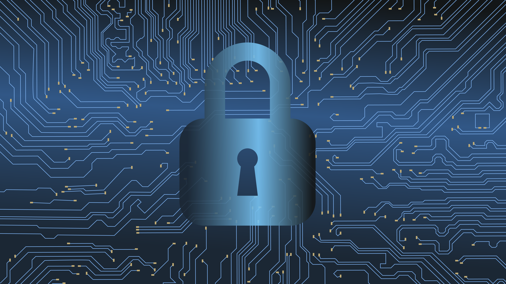

# Ebook Guía: Preparación Fundamental

{width=60% fig-alt="Ciberseguridad" fig-align="center"}

*Imagen: Ilustración de ciberseguridad. CC0 (Pixabay) vía Wikimedia Commons.*

## Bienvenida Institucional

**Fundamentos de Ciberseguridad — Agosto 2026**

Estimado estudiante:

Te damos la más cordial bienvenida al curso **Fundamentos de Ciberseguridad**, facilitado por **Diego Medardo Saavedra García** en representación de **Abacom**. Este Ebook Guía ha sido diseñado especialmente para ti, como material preparatorio para los módulos principales del curso.

Si no tienes experiencia previa con sistemas Linux, línea de comandos o entornos de desarrollo, **este es tu punto de partida**. Aquí construiremos juntos los fundamentos que necesitas para aprovechar al máximo cada sesión del curso.

> **"Conceptos primero, práctica después."** No corremos antes de caminar. Entendemos la teoría, luego la aplicamos.

---

## Diagnóstico Inicial: Punto de Partida

### Resultados del Examen de Diagnóstico Grupal

Al inicio del curso, aplicamos una evaluación diagnóstica para identificar el nivel de conocimientos previos del grupo. Los resultados fueron:

| Área Evaluada | Promedio | Estado |
|---------------|----------|--------|
| Fundamentos de redes | 48/100 | ⚠️ Requiere refuerzo |
| Comandos de consola | 42/100 | ⚠️ Requiere refuerzo |
| Conceptos de seguridad | 55/100 | ⚠️ Requiere refuerzo |
| Pensamiento lógico | 61/100 | ✓ Aceptable |
| **Promedio General** | **51.4/100** | ⚠️ **Nivel introductorio** |

### ¿Qué significan estos números?

Un promedio de **51.4/100 puntos** NO es un fracaso — es un diagnóstico honesto que nos dice dónde estamos parados. Las áreas críticas detectadas son:

1. **Comandos de consola (42/100):** La mayoría no tiene experiencia con terminal de Linux
2. **Fundamentos de redes (48/100):** Conceptos básicos de redes requieren refuerzo
3. **Conceptos de seguridad (55/100):** Hay nociones generales pero falta fundamentación técnica

> **Nota importante:** Los profesionales más experimentados en ciberseguridad comenzaron exactamente donde estás ahora. El diagnóstico no mide tu potencial — mide tu punto de partida.

---

## Cómo Utilizar este Ebook

### Estructura del Material

Este ebook contiene **6 módulos preparatorios**, **1 Proyecto Integrador (Capstone)** y **2 Apéndices complementarios** que debes completar en orden:

| Módulo | Tema | Objetivo |
|--------|------|----------|
| 1 | Fundamentos de Sistemas Operativos y Consola | Perderle el miedo a la terminal |
| 2 | Introducción a Kali Linux | Conocer la herramienta estándar de auditorías |
| 3 | Introducción a Git | Versionar tu trabajo como profesional |
| 4 | Introducción a Docker | Trabajar con contenedores sin enredos |
| 5 | Wargames — OverTheWire Bandit (Niveles 0-5) | Aplicar todo en retos prácticos |
| 6 | Wargames Avanzados — Bandit (Niveles 6-10) | Dominar búsqueda y filtrado avanzado |
| **Capstone** | **Proyecto Integrador: El Incidente en Abacom S.A.** | **Integrar todos los módulos en un escenario realista** |
| **Apéndice 1** | **Bandit Masterclass: Guía Definitiva de Wargames** | **Dominar OverTheWire Bandit con metodología profesional** |
| **Apéndice 2** | **Termux: Linux y Ciberseguridad en Android** | **Practicar desde dispositivos móviles sin PC** |

### Mapeo Visual: Ebook Guía y NIST CSF 2.0

Cada módulo de este ebook está alineado con funciones del **NIST Cybersecurity Framework 2.0**, el estándar internacional que estudiarás en el curso principal:

| Módulo | Función NIST | Categorías | Descripción |
|--------|--------------|------------|-------------|
| **1: Linux y Consola** | 🛡️ **PROTECT** | PR.AC, PR.PT | Control de acceso, gestión de usuarios y permisos |
| **2: Kali Linux** | 🔍 **IDENTIFY** | ID.RA, ID.SC | Evaluación de riesgos, análisis de vulnerabilidades |
| **3: Git** | 🛡️ **PROTECT** | PR.DS, PR.IP | Seguridad de datos, protección de información |
| **4: Docker** | 🛡️ **PROTECT** | PR.PT, PR.AC | Tecnología protectora, aislamiento de entornos |
| **5: Bandit (0-5)** | 🔍 **IDENTIFY** | ID.AM, ID.RA | Gestión de activos, evaluación de riesgos |
| **6: Bandit (6-10)** | 👁️ **DETECT** | DE.CM, DE.AE | Monitoreo continuo, análisis de eventos |

> **Nota:** Las funciones GOVERN, RESPOND y RECOVER de NIST CSF 2.0 se cubren en el curso principal. Este ebook establece las bases técnicas de PROTECT, IDENTIFY y DETECT.

### Técnica Pomodoro para el Estudio

Para optimizar tu concentración y evitar la fatiga cognitiva, aplicaremos la **Técnica Pomodoro** durante el estudio de este ebook:

```
┌─────────────────────────────────────────────────────────────┐
│                    TÉCNICA POMODORO                         │
├─────────────────────────────────────────────────────────────┤
│                                                             │
│   🍅 Ciclo 1: 25 min estudio → 5 min descanso              │
│   🍅 Ciclo 2: 25 min estudio → 5 min descanso              │
│   🍅 Ciclo 3: 25 min estudio → 5 min descanso              │
│   🍅 Ciclo 4: 25 min estudio → 15-20 min descanso largo    │
│                                                             │
│   Total: ~2 horas de estudio efectivo por sesión            │
│                                                             │
└─────────────────────────────────────────────────────────────┘
```

### Recomendaciones de Estudio

1. **Lee cada módulo en orden.** Los conocimientos se construyen progresivamente.
2. **Practica cada comando** en tu propia terminal o en el laboratorio virtual.
3. **No copies y pegues ciegamente.** Escribe los comandos a mano para desarrollar memoria muscular.
4. **Completa los ejercicios** al final de cada sección.
5. **Toma notas** de los errores que encuentren — son tu mejor material de estudio.
6. **Usa Pomodoro:** 25 minutos de estudio intenso, 5 minutos de descanso.

---

## Enfoque Pedagógico: Conceptos Primero, Práctica Después

Este ebook sigue el principio de **"conceptos primero, práctica después"**:

```
┌─────────────────────────────────────────────────────────────┐
│              NUESTRO ENFOQUE PEDAGÓGICO                     │
├─────────────────────────────────────────────────────────────┤
│                                                             │
│  1. ENTENDER → ¿Qué es y por qué es importante?             │
│  2. VER → Ejemplos y demostraciones                         │
│  3. HACER → Ejercicios guiados paso a paso                  │
│  4. APLICAR → Ejercicios independientes                     │
│  5. EVALUAR → Checklist de autoevaluación                   │
│                                                             │
└─────────────────────────────────────────────────────────────┘
```

No saltamos directamente a los ejercicios. Primero entendemos la teoría, luego la practicamos con guía, y finalmente te enfrentas a los retos por tu cuenta.

---

## Conexión con el Curso Principal

Este ebook te prepara directamente para:

| Unidad del Curso | Qué necesitas del Ebook |
|------------------|------------------------|
| **Unidad 1:** Marco NIST CSF 2.0 | Comprensión de conceptos básicos de seguridad |
| **Unidad 2:** Hardening y IAM | Manejo de consola, permisos, usuarios |
| **Unidad 3:** Zero Trust y Protocolos | Comprensión de redes y SSH |
| **Unidad 4:** Vulnerabilidades y Criptografía | Manejo de herramientas en Kali |
| **Unidad 5:** Respuesta a Incidentes | Integración de todo lo anterior |

---

## Criterios de Aprobación del Ebook

Para considerar que has completado satisfactoriamente este ebook, deberás:

- [ ] Completar los ejercicios de cada módulo
- [ ] Resolver al menos los niveles 0-3 de Bandit (Módulo 5)
- [ ] Crear tu primer repositorio Git con los ejercicios del curso
- [ ] Ejecutar comandos básicos de Docker sin asistencia
- [ ] Completar los 6 checklists de autoevaluación
- [ ] **Completar el Proyecto Integrador (Capstone)** con su portafolio de evidencias

---

## Proyecto Integrador (Capstone): "El Incidente en Abacom S.A."

Al finalizar los 6 módulos, enfrentarás tu reto final: **investigar un incidente de seguridad simulado** en la empresa Abacom S.A.

### ¿Qué es el Capstone?

Es un proyecto integrador donde asumes el rol de **Junior Security Analyst** y debes:
- Auditar accesos y permisos (Módulos 1, 6)
- Inspeccionar contenedores y red (Módulos 2, 4)
- Documentar evidencias en Git (Módulo 3)
- Elaborar un reporte alineado al NIST CSF 2.0 (Todos los módulos)

### Estructura del Proyecto

| Fase | Actividad | Función NIST |
|------|-----------|--------------|
| **Fase 1** | Auditoría de Accesos y Permisos | DETECT (DE.CM) |
| **Fase 2** | Inspección de Contenedores y Red | DETECT (DE.AE) |
| **Fase 3** | Control de Versiones y Evidencia | PROTECT (PR.IP) |
| **Fase 4** | Reporte de Incidentes | DETECT/RESPOND/PROTECT |

### Entregables Finales

- Repositorio Git con estructura profesional
- Informe de incidente en Markdown (`informe-incidente.md`)
- Evidencia de comandos y hashes de verificación
- Autoevaluación con rúbrica SETEC/Abacom

> **Nota:** El Capstone es tu portafolio de evidencias ante Abacom. Demuestra que no solo conoces comandos, sino que puedes **pensar como un analista de ciberseguridad**.

[→ Ir al Proyecto Integrador](./capstone-proyecto-integrador.qmd)

---

## Datos de Contacto

| | |
|---|---|
| **Facilitador** | Diego Medardo Saavedra García |
| **Institución** | Abacom |
| **Curso** | Fundamentos de Ciberseguridad — Agosto 2026 |

---

> **"La ciberseguridad no se aprende memorizando, se aprende rompiendo cosas y arreglándolas. Bienvenido al laboratorio."**

Comencemos con el Módulo 1: Fundamentos de Sistemas Operativos y Consola.

---

← [Inicio](./index.qmd) | [Módulo 1: Linux y Consola](./modulo-01-linux-consola.qmd) → | [Proyecto Integrador (Capstone)](./capstone-proyecto-integrador.qmd) 🏆 → | [Bandit Masterclass](./apendice-bandit-masterclass.qmd) 🎯 → | [Apéndice Termux](./apendice-termux.qmd) 📱 →
