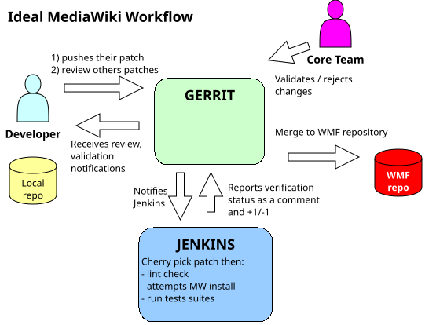

# Módulo 3: Introducción a Git — Control de Versiones

{width=70% fig-alt="Diagrama flujo Git" fig-align="center"}

*Imagen: Diagrama de flujo de trabajo Git. CC-BY-SA 3.0 por hashar, vía Wikimedia Commons.*

## Objetivos de Aprendizaje

Al finalizar este módulo, serás capaz de:

1. **Explicar** qué es Git y por qué es vital en ciberseguridad
2. **Crear** un repositorio local y remoto
3. **Ejecutar** el flujo básico: add, commit, push, pull
4. **Usar** .gitignore para proteger información sensible
5. **Respaldar** tu código y laboratorios en un repositorio remoto

---

> **🔗 Conexión con NIST CSF 2.0**
> | Función | Categoría | Aplicación |
> |---------|-----------|------------|
> | **PROTECT** | PR.DS (Data Security) | Protección de código fuente y datos sensibles con .gitignore |
> | **PROTECT** | PR.IP (Information Protection) | Integridad del código, cadena de custodia de evidencia |
>
> *Este módulo desarrolla capacidades de PROTECT: aprenderás a proteger información sensible y mantener la integridad de tus proyectos.*

---

## 3.1 — ¿Qué es Git y Por Qué te Importa?

### Control de Versiones Explicado Simple

Imagina que estás escribiendo un reporte de auditoría. Haces cambios, tu compañero hace cambios, y de repente tienes 5 versiones diferentes llamadas `reporte_final.doc`, `reporte_final_FINAL.doc`, `reporte_final_FINAL_v2.doc`...

**Git resuelve este problema.**

```
┌─────────────────────────────────────────────────────────────────┐
│                    ¿QUÉ ES GIT?                                 │
├─────────────────────────────────────────────────────────────────┤
│                                                                 │
│  Git es un sistema de control de versiones DISTRIBUIDO.         │
│                                                                 │
│  • Registra cada cambio que haces en tus archivos               │
│  • Permite volver a cualquier versión anterior                  │
│  • Facilita la colaboración sin sobrescribir trabajo            │
│  • Es la herramienta estándar de la industria                   │
│                                                                 │
└─────────────────────────────────────────────────────────────────┘
```

### ¿Por qué es Vital en Ciberseguridad?

| Uso | Descripción |
|-----|-------------|
| **Scripts de pentesting** | Versiona tus herramientas personalizadas |
| **Documentación de hallazgos** | Registra cambios en reportes de auditoría |
| **Evidencia forense** | Mantiene cadena de custodia del código |
| **Colaboración en equipo** | Múltiples analistas trabajan sin conflictos |
| **Auditoría** | Cada cambio queda registrado con autor y fecha |

> **Nota de Seguridad:** NUNCA subas contraseñas, claves API o datos sensibles a un repositorio Git (aunque sea privado). Usa `.gitignore` para excluir archivos con información sensible.

---

## 3.2 — Conceptos Clave (Sin Rodeos)

### Los 5 Conceptos que Debes Dominar

```
┌─────────────────────────────────────────────────────────────────┐
│                    FLUJO DE TRABAJO GIT                         │
├─────────────────────────────────────────────────────────────────┤
│                                                                 │
│  REPOSITORIO → COMMIT → PUSH → PULL → GITIGNORE                │
│                                                                 │
│  • Repositorio: Carpeta donde Git rastrea cambios               │
│  • Commit: "Foto" de tus cambios en un momento dado             │
│  • Push: Subir tus cambios al repositorio remoto                │
│  • Pull: Descargar cambios del repositorio remoto               │
│  • .gitignore: Archivos que Git debe ignorar                    │
│                                                                 │
└─────────────────────────────────────────────────────────────────┘
```

### Comparación con Términos Conocidos

| Término Git | Analogía |
|-------------|----------|
| Repositorio (repo) | Carpeta del proyecto con control de versiones |
| Commit | "Foto" o "punto de guardado" de tus cambios |
| Stage (index) | Área de preparación antes de hacer commit |
| Push | Subir cambios a la nube (GitHub/GitLab) |
| Pull | Bajar cambios de la nube a tu máquina |
| Branch | Línea de desarrollo paralela |
| Merge | Combinar cambios de dos ramas |
| Clone | Copiar un repositorio remoto a tu máquina |

---

## 3.3 — Instalación y Configuración Inicial

### Instalar Git

```bash
# Linux (Debian/Ubuntu)
sudo apt update
sudo apt install git -y

# Verificar instalación
git --version
# Esperado: git version 2.43.x o superior
```

### Configurar tu Identidad (OBLIGATORIO)

```bash
# Configurar nombre (aparecerá en tus commits)
git config --global user.name "Tu Nombre Completo"

# Configurar email (debe coincidir con tu GitHub)
git config --global user.email "tu@email.com"

# Verificar configuración
git config --list
```

> **Buenas Prácticas:** Usa el mismo email que en tu cuenta de GitHub para que los commits se asocien correctamente a tu perfil.

---

## 3.4 — Flujo de Trabajo Mínimo Indispensable

### Paso a Paso: De Cero a Repositorio Remoto

#### Paso 1: Crear un Repositorio Local

```bash
# Crear carpeta del proyecto
mkdir curso-ciberseguridad
cd curso-ciberseguridad

# Inicializar Git en esta carpeta
git init
```

#### Paso 2: Crear un Archivo

```bash
# Crear tu primer archivo
echo "# Mi Proyecto de Ciberseguridad" > README.md
echo "" >> README.md
echo "Repositorio del curso Fundamentos de Ciberseguridad" >> README.md
```

#### Paso 3: Verificar el Estado

```bash
# Ver qué archivos han cambiado
git status
```

#### Paso 4: Preparar Archivos (Stage)

```bash
# Agregar un archivo específico al área de preparación
git add README.md

# O agregar todos los archivos nuevos/modificados
git add .
```

#### Paso 5: Hacer Commit

```bash
# Crear un "punto de guardado" con descripción
git commit -m "Commit inicial: agrego README del proyecto"
```

#### Paso 6: Conectar con Repositorio Remoto (GitHub)

```bash
# Agregar repositorio remoto
git remote add origin https://github.com/tu-usuario/curso-ciberseguridad.git

# Subir tus cambios
git push -u origin main
```

---

## 3.5 — El Archivo .gitignore

### ¿Por qué es Crítico en Ciberseguridad?

El archivo `.gitignore` le dice a Git qué archivos **NO** debe rastrear. Esto es **fundamental** cuando trabajas con:

- Contraseñas y claves
- Archivos de configuración con datos sensibles
- Binarios y archivos temporales
- Entornos virtuales de Python

### Ejemplo de .gitignore para Proyectos de Seguridad

```gitignore
# ── Credenciales y claves ──
*.key
*.pem
*.secret
.env
config/secrets.yml

# ── Archivos temporales ──
*.tmp
*.log
*.swp
*~

# ── Entornos virtuales ──
venv/
env/
.venv/

# ── Archivos del sistema ──
.DS_Store
Thumbs.db

# ── Reportes con datos sensibles ──
reportes/confidencial/
evidencia/clientes/
```

```bash
# Crear el archivo .gitignore
nano .gitignore

# Pega el contenido anterior, guarda (Ctrl+O) y sal (Ctrl+X)
```

> **Nota de Seguridad:** Si accidentalmente subiste una contraseña a Git, **cambia la contraseña inmediatamente**. Eliminar el archivo del historial de Git no es suficiente — el dato puede seguir accesible en commits anteriores.

::: {.callout-note}
**ISO 31000 — Gestión de Riesgos en Control de Versiones**

La norma **ISO 31000** aplica directamente al uso de Git en proyectos de seguridad:

- **Identificación de riesgos:** ¿Qué información sensible podría exponerse en un repositorio público? (credenciales, IPs internas, datos de clientes)
- **Evaluación de riesgos:** Impacto de una filtración de credenciales vs. probabilidad de que ocurra
- **Tratamiento del riesgo:** `.gitignore` como control preventivo, archivos `.env` fuera del repositorio, uso de variables de entorno
- **Monitoreo:** Herramientas como `git-secrets`, `truffleHog` o `gitleaks` para detectar secretos antes del push

> **Principio clave:** El control de versiones es una **herramienta de mitigación de riesgos** — permite rastrear cambios, revertir errores y auditar quién hizo qué. Pero también introduce riesgos si no se configura adecuadamente.
:::

---

## 3.6 — Comandos Esenciales de Git

### Tu Referencia Rápida

| Comando | Función | Cuándo Usarlo |
|---------|---------|---------------|
| `git init` | Inicializar repositorio | Una vez por proyecto |
| `git status` | Ver estado de archivos | Siempre, antes de commit |
| `git add archivo` | Preparar archivo para commit | Después de modificar |
| `git add .` | Preparar TODOS los archivos | Cuando hay muchos cambios |
| `git commit -m "msg"` | Guardar cambios localmente | Después de cada "unidad de trabajo" |
| `git push` | Subir cambios al remoto | Después de varios commits |
| `git pull` | Bajar cambios del remoto | Al iniciar sesión en otra máquina |
| `git log --oneline` | Ver historial de commits | Para revisar cambios pasados |
| `git clone URL` | Copiar repositorio remoto | Para obtener copia de un proyecto |

---

## 3.7 — Resolución de Problemas Comunes

### Error: "fatal: not a git repository"

```bash
# Causa: No estás en una carpeta con Git inicializado
# Solución:
git init
# O navega a la carpeta correcta
cd /ruta/al/proyecto
```

### Error: "Permission denied (publickey)"

```bash
# Causa: No tienes configurada tu clave SSH
# Solución: Generar clave SSH y agregarla a GitHub
ssh-keygen -t ed25519 -C "tu@email.com"
cat ~/.ssh/id_ed25519.pub
# Copia la salida y agrégala en GitHub → Settings → SSH Keys
```

### Error: "Updates were rejected"

```bash
# Causa: El remoto tiene cambios que no tienes localmente
# Solución: Primero bajar cambios, luego subir
git pull origin main --rebase
git push origin main
```

### Error: "merge conflict"

```bash
# Causa: Dos personas modificaron la misma línea
# Solución: Editar el archivo manualmente
# Busca los marcadores <<<<<<< ======= >>>>>>>>
# Mantén el código correcto, elimina los marcadores
git add .
git commit -m "Resuelvo conflicto de merge"
```

---

## Ejercicios Prácticos — Módulo 3

### Ejercicio 1: Crear tu Repositorio del Curso

```bash
# 1. Crear carpeta
mkdir ~/curso-ciberseguridad
cd ~/curso-ciberseguridad

# 2. Inicializar Git
git init

# 3. Crear README.md
echo "# Fundamentos de Ciberseguridad" > README.md
echo "" >> README.md
echo "Mi nombre: [tu nombre]" >> README.md
echo "Fecha de inicio: [fecha]" >> README.md

# 4. Crear .gitignore
echo "*.log" > .gitignore
echo "*.tmp" >> .gitignore
echo ".env" >> .gitignore

# 5. Verificar estado
git status

# 6. Preparar archivos
git add .

# 7. Hacer commit
git commit -m "Inicio del curso: estructura base del repositorio"
```

### Ejercicio 2: Simular Cambios

```bash
# 1. Agregar contenido al README
echo "" >> README.md
echo "## Módulo 1: Linux" >> README.md
echo "- Aprendí comandos básicos de terminal" >> README.md

# 2. Ver qué cambió
git diff

# 3. Preparar y commitear
git add README.md
git commit -m "Agrego notas del Módulo 1"

# 4. Ver historial
git log --oneline
```

---

## Checklist de Autoevaluación — Módulo 3

Antes de continuar al Módulo 4, asegúrate de poder:

- [ ] Explicar qué es Git en términos simples
- [ ] Crear un repositorio local con `git init`
- [ ] Hacer un commit con mensaje descriptivo
- [ ] Crear un archivo .gitignore
- [ ] Entender la diferencia entre add, commit y push
- [ ] Conocer los comandos esenciales de Git
- [ ] Resolver errores comunes básicos

---

> **"En ciberseguridad, si no está versionado, no existe. Git es tu memoria institucional."**

---

← [Módulo 2: Kali Linux](./modulo-02-kali-linux.qmd) | [Módulo 4: Docker](./modulo-04-docker.qmd) →
