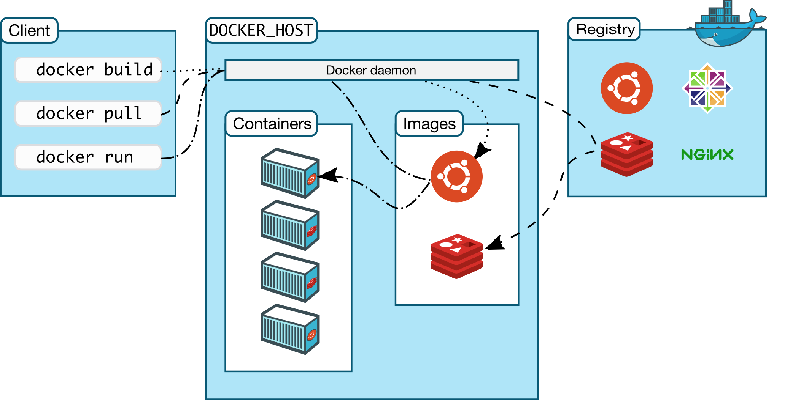

# Módulo 4: Introducción a Docker — Contenedores

{width=75% fig-alt="Arquitectura Docker" fig-align="center"}

*Imagen: Arquitectura de contenedores Docker. CC0 vía Wikimedia Commons.*

## Objetivos de Aprendizaje

Al finalizar este módulo, serás capaz de:

1. **Explicar** qué es un contenedor y en qué se diferencia de una VM
2. **Ejecutar** comandos esenciales de Docker
3. **Interactuar** con contenedores en ejecución
4. **Gestionar** el ciclo de vida básico de contenedores

---

> **🔗 Conexión con NIST CSF 2.0**
> | Función | Categoría | Aplicación |
> |---------|-----------|------------|
> | **PROTECT** | PR.PT (Protective Technology) | Aislamiento de contenedores, gestión de imágenes seguras |
> | **PROTECT** | PR.AC (Access Control) | Control de acceso a contenedores, permisos de usuario |
>
> *Este módulo desarrolla capacidades de PROTECT: aprenderás a aislar entornos y controlar el acceso a recursos mediante contenedores.*

---

## 4.1 — ¿Qué es un Contenedor?

### La Analogía del Contenedor Marítimo

Imagina el transporte de mercancías antes de los contenedores estandarizados: cada producto se empaquetaba de forma diferente, haciendo la carga y descarga lenta e ineficiente. Luego llegaron los **contenedores marítimos** — estandarizaron el tamaño y la forma, permitiendo que cualquier grúa, barco o camión pudiera manejar cualquier carga.

**Docker hace lo mismo con el software:**

```
┌─────────────────────────────────────────────────────────────────┐
│              MÁQUINA VIRTUAL vs CONTENEDOR                      │
├─────────────────────────────────────────────────────────────────┤
│                                                                 │
│  MÁQUINA VIRTUAL              CONTENEDOR                        │
│  ┌─────────────────┐          ┌─────────────────┐              │
│  │   App A         │          │   App A         │              │
│  ├─────────────────┤          ├─────────────────┤              │
│  │   Guest OS      │          │                 │              │
│  ├─────────────────┤          │   (comparte     │              │
│  │   Hypervisor    │          │    kernel del   │              │
│  ├─────────────────┤          │    host)        │              │
│  │   Host OS       │          ├─────────────────┤              │
│  ├─────────────────┤          │   Host OS       │              │
│  │   Hardware      │          ├─────────────────┤              │
│  └─────────────────┘          │   Hardware      │              │
│                               └─────────────────┘              │
│  • Pesado (GBs)               • Liviano (MBs)                  │
│  • Inicio lento (minutos)     • Inicio rápido (segundos)        │
│  • Aislamiento completo       • Aislamiento a nivel de proceso  │
│  • Consume muchos recursos    • Eficiente en recursos           │
│                                                                 │
└─────────────────────────────────────────────────────────────────┘
```

### ¿Por qué Docker en Ciberseguridad?

| Ventaja | Aplicación en Seguridad |
|---------|------------------------|
| **Portabilidad** | Mismo entorno de laboratorio en cualquier máquina |
| **Aislamiento** | Ejecutar herramientas sospechosas sin afectar el host |
| **Reproducibilidad** | Laboratorios idénticos para todos los estudiantes |
| **Rapidez** | Desplegar entornos de práctica en segundos |
| **Desechabilidad** | Destruir y recrear entornos contaminados |

> **Nota de Seguridad:** Los contenedores NO son un reemplazo de las máquinas virtuales para aislamiento de malware avanzado. Comparten el kernel del host, por lo que un escape de contenedor podría comprometer el sistema principal.

---

## 4.2 — Conceptos Básicos de Docker

### Terminología Esencial

| Término | Definición |
|---------|------------|
| **Imagen** | Plantilla de solo lectura con todo lo necesario para ejecutar una aplicación |
| **Contenedor** | Instancia en ejecución de una imagen |
| **Dockerfile** | Archivo de texto con instrucciones para construir una imagen |
| **Volumen** | Almacenamiento persistente fuera del contenedor |
| **Red** | Comunicación entre contenedores y el exterior |
| **Registry** | Repositorio de imágenes (Docker Hub es el más popular) |

### Analogía Simple

```
IMAGEN → Receta de cocina
CONTENEDOR → El plato preparado siguiendo la receta
DOCKERFILE → Las instrucciones escritas de la receta
REGISTRY → Librería de recetas (como Docker Hub)
```

---

## 4.3 — Comandos Esenciales

### Tu Kit de Supervivencia en Docker

#### Ver Contenedores Activos

```bash
# Ver contenedores en ejecución
docker ps

# Ver TODOS los contenedores (incluyendo detenidos)
docker ps -a

# Ejemplo de salida:
# CONTAINER ID   IMAGE        STATUS          NAMES
# a1b2c3d4e5f6   kali_linux   Up 2 hours      laboratorio-01
```

#### Entrar a un Contenedor en Ejecución

```bash
# Entrar a la terminal interactiva de un contenedor
docker exec -it laboratorio-01 bash

# Explicación:
# - exec: ejecutar un comando dentro del contenedor
# - -i: interactivo (mantener stdin abierto)
# - -t: asignar un terminal pseudo-TTY
# - laboratorio-01: nombre del contenedor
# - bash: comando a ejecutar (la shell)
```

#### Gestionar el Ciclo de Vida

```bash
# Iniciar un contenedor detenido
docker start laboratorio-01

# Detener un contenedor en ejecución
docker stop laboratorio-01

# Reiniciar un contenedor
docker restart laboratorio-01

# Eliminar un contenedor detenido
docker rm laboratorio-01
```

#### Ver Imágenes Disponibles

```bash
# Listar imágenes descargadas
docker images

# Descargar una imagen
docker pull kalilinux/kali-rolling

# Eliminar una imagen
docker rmi kalilinux/kali-rolling
```

---

## 4.4 — Flujo de Trabajo Práctico

### Escenario: Laboratorio de Ciberseguridad con Kali

```bash
# 1. Descargar la imagen oficial de Kali
docker pull kalilinux/kali-rolling

# 2. Verificar que la imagen se descargó
docker images

# 3. Crear y ejecutar un contenedor
docker run -it --name mi-kali kalilinux/kali-rolling bash

# Explicación:
# - run: crear y ejecutar un contenedor nuevo
# - -it: modo interactivo con terminal
# - --name mi-kali: nombre del contenedor
# - kalilinux/kali-rolling: imagen a usar
# - bash: comando inicial

# 4. Dentro del contenedor, actualizar paquetes
apt update && apt upgrade -y

# 5. Instalar herramientas necesarias
apt install -y nmap curl wget

# 6. Salir del contenedor (sin detenerlo: Ctrl+P, Ctrl+Q)
#    O salir y detenerlo: exit

# 7. Ver contenedores en ejecución
docker ps

# 8. Volver a entrar al contenedor
docker exec -it mi-kali bash

# 9. Detener el contenedor cuando termines
docker stop mi-kali

# 10. Eliminar el contenedor cuando ya no lo necesites
docker rm mi-kali
```

---

## 4.5 — Solución de Problemas Comunes

### Error: "Cannot connect to the Docker daemon"

```bash
# Causa: Docker no está corriendo
# Solución: Iniciar el servicio
sudo systemctl start docker

# Verificar estado
sudo systemctl status docker
```

### Error: "permission denied while trying to connect"

```bash
# Causa: Tu usuario no tiene permisos para usar Docker
# Solución: Agregar tu usuario al grupo docker
sudo usermod -aG docker $USER

# Cerrar sesión y volver a iniciar (o usar):
newgrp docker
```

### Error: "port is already allocated"

```bash
# Causa: El puerto ya está en uso
# Solución: Ver qué usa el puerto
sudo lsof -i :8080

# O usar otro puerto
docker run -p 9090:80 nginx
```

### Contenedor se Detiene Inmediatamente

```bash
# Causa: No hay proceso en primer plano
# Solución: Mantener un proceso activo
docker run -it --name test kalilinux/kali-rolling bash

# O usar -d para ejecutar en segundo plano con un proceso
docker run -d --name web nginx
```

---

## 4.6 — Buenas Prácticas con Docker

### Lo que SÍ Debes Hacer

```
✅ Usar imágenes oficiales de Docker Hub
✅ Nombrar tus contenedores con --name descriptivos
✅ Usar volúmenes para datos persistentes
✅ Limpiar contenedores no usados regularmente
✅ Leer la documentación de cada imagen antes de usarla
```

### Lo que NO Debes Hacer

```
❌ Ejecutar contenedores como root innecesariamente
❌ Montar el sistema de archivos del host completo
❌ Dejar puertos expuestos sin necesidad
❌ Incluir credenciales en las imágenes
❌ Usar Docker para aislar malware avanzado sin precauciones
```

### Comandos de Limpieza

```bash
# Eliminar contenedores detenidos
docker container prune

# Eliminar imágenes no usadas
docker image prune -a

# Eliminar todo lo no usado (contenedores, imágenes, volúmenes, redes)
docker system prune -a
```

---

## Ejercicios Prácticos — Módulo 4

### Ejercicio 1: Primer Contenedor

```bash
# 1. Verificar que Docker está corriendo
docker info

# 2. Descargar imagen de Alpine (liviana)
docker pull alpine

# 3. Ejecutar contenedor interactivo
docker run -it --name mi-primer-contenedor alpine sh

# 4. Dentro del contenedor, ejecutar comandos
ls -la
whoami
cat /etc/os-release

# 5. Salir del contenedor
exit

# 6. Ver contenedores (incluyendo detenidos)
docker ps -a

# 7. Eliminar el contenedor
docker rm mi-primer-contenedor
```

### Ejercicio 2: Contenedor con Nginx

```bash
# 1. Ejecutar Nginx en segundo plano
docker run -d --name mi-web -p 8080:80 nginx

# 2. Verificar que está corriendo
docker ps

# 3. Probar que responde (en otra terminal)
curl http://localhost:8080

# 4. Ver logs del contenedor
docker logs mi-web

# 5. Entrar al contenedor
docker exec -it mi-web bash

# 6. Detener y eliminar
docker stop mi-web
docker rm mi-web
```

---

## Checklist de Autoevaluación — Módulo 4

Antes de continuar al Módulo 5, asegúrate de poder:

- [ ] Explicar la diferencia entre contenedor y VM
- [ ] Listar contenedores con `docker ps`
- [ ] Entrar a un contenedor con `docker exec -it`
- [ ] Iniciar y detener contenedores
- [ ] Entender qué es una imagen vs contenedor
- [ ] Resolver errores comunes de Docker
- [ ] Aplicar buenas prácticas básicas

---

> **"Docker es tu laboratorio portátil. Puedes crear, destruir y recrear entornos completos en segundos. Úsalo con inteligencia."**

---

← [Módulo 3: Git](./modulo-03-git.qmd) | [Módulo 5: Wargames Bandit](./modulo-05-wargames.qmd) →
