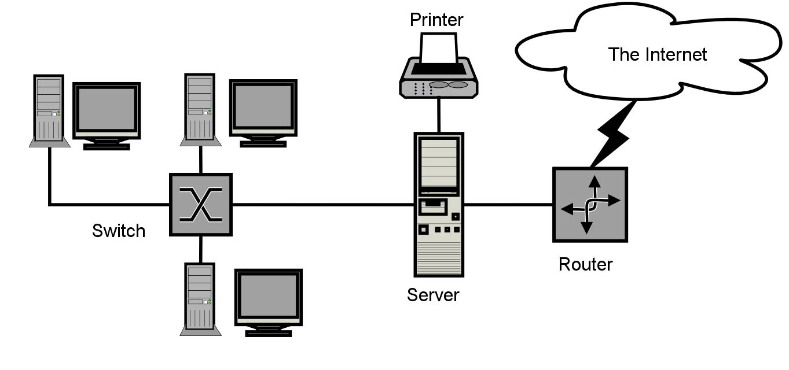

# Módulo 6: Escalando en Bandit (Niveles 6 al 10)

{width=65% fig-alt="Diagrama de red" fig-align="center"}

*Imagen: Diagrama de red de seguridad. CC-BY-SA 3.0 por SilverStar, vía Wikimedia Commons.*

## Objetivos de Aprendizaje

Al finalizar este módulo, serás capaz de:

1. **Buscar archivos** con criterios múltiples usando `find`
2. **Filtrar texto** en archivos masivos con `grep`
3. **Procesar datos** con `sort`, `uniq` y `strings`
4. **Documentar** tu progreso de forma sistemática

---

¡Excelente trabajo completando los primeros niveles de Bandit! En este módulo profundizaremos en la búsqueda avanzada de archivos, compresión de datos y análisis de cadenas de texto dentro del entorno Linux.

**Requisitos previos:** Haber completado el Módulo 5 (niveles 0-5 de Bandit) o tener experiencia equivalente con comandos de Linux.

---

> **🔗 Conexión con NIST CSF 2.0**
> | Función | Categoría | Aplicación |
> |---------|-----------|------------|
> | **DETECT** | DE.CM (Continuous Monitoring) | Búsqueda proactiva de archivos y análisis de logs |
> | **DETECT** | DE.AE (Adverse Event Analysis) | Filtrado de eventos, identificación de anomalías |
>
> *Este módulo desarrolla capacidades de DETECT: aprenderás a buscar indicios de seguridad y analizar eventos en sistemas.*

---

## 6.1 — Comandos Esenciales para este Bloque

| Comando | Descripción | Ejemplo de Uso |
|---------|-------------|----------------|
| `find` | Busca archivos según tamaño, permisos o propietario | `find / -size 33c` |
| `file` | Identifica el tipo real de un archivo | `file data07` |
| `strings` | Extrae cadenas de texto imprimibles de archivos binarios | `strings data.bin \| grep secret` |
| `base64` | Codifica o decodifica datos en Base64 | `base64 -d encoded.txt` |
| `uniq` | Filtra o reporta líneas repetidas | `sort data.txt \| uniq -u` |
| `sort` | Ordena líneas de texto | `sort data.txt` |
| `grep` | Busca patrones en texto | `grep "pattern" archivo` |

### Ejemplos Prácticos

```bash
# find - búsqueda con múltiples criterios
find / -type f -user bandit7 -group bandit6 -size 33c 2>/dev/null

# Explicación:
# - find / : buscar desde la raíz
# - -type f : solo archivos
# - -user bandit7 : que pertenezca al usuario bandit7
# - -group bandit6 : que pertenezca al grupo bandit6
# - -size 33c : tamaño exacto de 33 bytes
# - 2>/dev/null : redirigir errores (permisos denegados) a la nada

# strings + grep - extraer texto de binarios
strings data.txt | grep "==="

# Explicación:
# - strings : extrae cadenas imprimibles de archivos binarios
# - | : tubería, pasa la salida de strings a grep
# - grep "===" : filtra solo las líneas que contienen "==="

# sort + uniq - encontrar líneas únicas
sort data.txt | uniq -u

# Explicación:
# - sort : ordena las líneas (requerido antes de uniq)
# - uniq -u : muestra solo las líneas que aparecen UNA vez
```

---

## 6.2 — Pistas Estructuradas por Nivel (Sin Respuestas Directas)

### Nivel 6 al Nivel 7

> **Objetivo:** Encontrar un archivo que pertenece a un usuario y grupo específicos, con un tamaño exacto de 33 bytes.

**Pista lógica:**

- No busques a ciegas por todo el disco. Utiliza el comando `find` combinando los parámetros `-user`, `-group` y `-size`.
- Recuerda redirigir los errores estándar (`2>/dev/null`) para mantener tu terminal limpia de mensajes de "Permiso denegado".

```bash
# Estructura del comando que necesitas:
find / -type f -user [usuario] -group [grupo] -size [tamaño] 2>/dev/null
```

---

### Nivel 7 al Nivel 8

> **Objetivo:** Encontrar la contraseña almacenada en el archivo `data.txt` justo al lado de la palabra "millionth".

**Pista lógica:**

- El archivo es muy grande para abrirlo con `cat`.
- Utiliza herramientas de filtrado de texto como `grep` para buscar patrones específicos dentro de archivos masivos.

```bash
# Cuando necesitas buscar una palabra específica en un archivo grande:
grep "palabra_clave" archivo.txt
```

---

### Nivel 8 al Nivel 9

> **Objetivo:** Encontrar la línea única (que aparece una sola vez) en el archivo `data.txt`.

**Pista lógica:**

- El comando `uniq` requiere que las líneas estén ordenadas previamente.
- Utiliza el operador de tubería (`|`) para conectar `sort` con `uniq -u`.

```bash
# El flujo correcto es:
# 1. Ordenar el archivo
# 2. Filtrar líneas únicas
sort data.txt | uniq -u
```

---

### Nivel 9 al Nivel 10

> **Objetivo:** Encontrar la contraseña en un archivo binario precedida por varios caracteres de igualdad (`=`).

**Pista lógica:**

- Los archivos binarios contienen datos ilegibles para el ojo humano. Usa el comando `strings` para extraer texto legible.
- Filtra el resultado usando `grep` con una expresión regular para buscar los signos de igual.

```bash
# Para extraer texto de un archivo binario:
strings data.txt

# Para filtrar solo las líneas con "=":
strings data.txt | grep "==="
```

---

## 6.3 — Tabla Resumen: Niveles 6 al 10

| Nivel | Comando Principal | Concepto Clave |
|-------|-------------------|----------------|
| 6 → 7 | `find -user -group -size` | Búsqueda con criterios múltiples |
| 7 → 8 | `grep "palabra"` | Filtrado de texto en archivos masivos |
| 8 → 9 | `sort \| uniq -u` | Identificación de líneas únicas |
| 9 → 10 | `strings \| grep` | Extracción de texto de binarios |

---

## 6.4 — Nota de Seguridad y Buenas Prácticas

> **Nota de Seguridad:** Al utilizar herramientas de búsqueda masiva como `find` en sistemas de producción reales, evita saturar el almacenamiento o generar denegaciones de servicio accidentales en los discos analizados.

### Buenas Prácticas de Búsqueda

```
┌─────────────────────────────────────────────────────────────────┐
│                BUENAS PRÁCTICAS CON FIND                        │
├─────────────────────────────────────────────────────────────────┤
│                                                                 │
│  ✅ Usa 2>/dev/null para limpiar la salida de errores            │
│  ✅ Sé específico en tus criterios (usuario, grupo, tamaño)     │
│  ✅ Redirige la búsqueda a directorios específicos cuando puedas │
│  ✅ Evita buscar en /proc, /sys (sistemas de archivos virtuales)│
│                                                                 │
│  ⚠️ CUIDADO:                                                    │
│  ⚠️ find / busca en TODO el sistema — puede ser lento           │
│  ⚠️ Redes, montajes NFS y discos externos se incluyen           │
│  ⚠️ En producción, coordina con el equipo antes de buscar       │
│                                                                 │
└─────────────────────────────────────────────────────────────────┘
```

### Documenta tu Progreso

```bash
# Crear tu diario de wargames (si no lo has hecho)
touch ~/wargames-notas.txt

# Agregar entrada para cada nivel resuelto
cat << EOF >> ~/wargames-notas.txt

NIVEL 6 → 7:
- Comando usado: find / -type f -user bandit7 -group bandit6 -size 33c 2>/dev/null
- Aprendí: Búsqueda con criterios múltiples en find
- Contraseña: [guardar aquí]

NIVEL 7 → 8:
- Comando usado: grep "millionth" data.txt
- Aprendí: Filtrado de texto con grep en archivos grandes
- Contraseña: [guardar aquí]

EOF
```

---

## 6.5 — Detección y Respuesta a Incidentes (NIST SP 800-61 + RESPOND en NIST CSF 2.0)

### Del DETECT al RESPOND: ¿Qué Haces Cuando Encontras Algo?

Hasta ahora en este módulo has aprendido a **buscar** archivos y analizar contenido (DETECT). Pero la ciberseguridad no termina en la detección — el siguiente paso es **responder** apropiadamente cuando encuentras algo sospechoso.

```
┌─────────────────────────────────────────────────────────────────┐
│              DEL DETECT AL RESPOND                              │
├─────────────────────────────────────────────────────────────────┤
│                                                                 │
│  1. DETECTAS → Encuentras un archivo con contraseñas           │
│  2. ANALIZAS → Determinas su contenido y criticidad            │
│  3. REPORTAS → Informas al equipo o al administrador           │
│  4. CONTAINES → Evitas que el problema se propague             │
│  5. DOCUMENTAS → Registras todo para auditoría                 │
│                                                                 │
└─────────────────────────────────────────────────────────────────┘
```

### Escenario Práctico: Encontraste un Archivo Sensible

Imagina que durante un ejercicio de auditoría encuentras un archivo con permisos incorrectos que contiene datos sensibles. ¿Qué haces?

| Paso | Acción | Comando/Herramienta |
|------|--------|---------------------|
| **1. Verificar** | Confirmar el hallazgo | `ls -la`, `file`, `cat` |
| **2. Documentar** | Registrar qué encontraste | Captura de pantalla, notas |
| **3. Evaluar** | Determinar la criticidad | ¿Es información real o de laboratorio? |
| **4. Reportar** | Informar al responsable | Email, ticket, mensaje al facilitador |
| **5. No difundir** | No compartir el contenido | Eliminar copias locales si es necesario |

> **Nota de Seguridad:** En un entorno real, **nunca** copies, compartas o difundas información sensible que encuentres. El procedimiento correcto es documentar y reportar inmediatamente. Compartir contraseñas o datos sin autorización puede tener consecuencias legales.

### Conexión con NIST CSF 2.0: Función RESPOND

| Categoría | Descripción | Aplicación en este Módulo |
|-----------|-------------|---------------------------|
| **RS.MA** (Incident Management) | Gestión de incidentes detectados | Saber qué hacer cuando encuentras algo |
| **RS.AN** (Incident Analysis) | Análisis del incidente | Determinar criticidad del hallazgo |
| **RS.CO** (Incident Response Communication) | Comunicación de la respuesta | Reportar adecuadamente |

> **Recuerda:** En el curso principal de Abacom profundizarás en los procedimientos formales de respuesta a incidentes. Aquí solo establishes la base: **detectar → analizar → reportar → documentar**.

### Fases de Respuesta a Incidentes según NIST SP 800-61

El estándar **NIST SP 800-61** (Computer Security Incident Handling Guide) define 4 fases fundamentales para manejar incidentes de seguridad. Estas fases se alinean directamente con el caso práctico del Capstone Project:

| Fase | Nombre | Descripción | Conexión con el Capstone |
|------|--------|-------------|--------------------------|
| **1. Preparación** | Preparation | Establecer políticas, herramientas y capacidades antes de que ocurra un incidente | Configurar tu entorno Kali Linux (Módulo 2) y herramientas de auditoría |
| **2. Detección y Análisis** | Detection & Analysis | Identificar incidentes mediante monitoreo, logs y análisis de indicios | Usar `find`, `grep`, `strings` para hallazgos sospechosos (este módulo) |
| **3. Contención, Erradicación y Recuperación** | Containment, Eradication & Recovery | Limitar daño, eliminar la causa raíz y restaurar sistemas | Aislar sistemas comprometidos, eliminar backdoors, restaurar servicios |
| **4. Actividad Post-Incidente** | Post-Incident Activity | Documentar lecciones aprendidas, actualizar políticas y prevenir recurrencia | Elaborar informe final del Capstone con recomendaciones |

```
┌─────────────────────────────────────────────────────────────────────────────┐
│                    CICLO DE VIDA NIST SP 800-61                             │
├─────────────────────────────────────────────────────────────────────────────┤
│                                                                             │
│    ┌──────────────┐     ┌─────────────────────┐     ┌──────────────────┐   │
│    │  PREPARACIÓN │────→│ DETECCIÓN Y ANÁLISIS│────→│   CONTENCIÓN     │   │
│    │              │     │                     │     │   ERRADICACIÓN   │   │
│    └──────────────┘     └─────────────────────┘     │   RECUPERACIÓN   │   │
│           ▲                                          └────────┬─────────┘   │
│           │                                                   │             │
│           │              ┌─────────────────────┐              │             │
│           └──────────────│ ACTIVIDAD POST-     │◄─────────────┘             │
│                          │ INCIDENTE           │                            │
│                          └─────────────────────┘                            │
│                                                                             │
└─────────────────────────────────────────────────────────────────────────────┘
```

::: {.callout-note}
**Conexión con el Capstone Project:** En el caso práctico "El Incidente en Abacom S.A." (ver [Capstone](./capstone-proyecto-integrador.qmd)), aplicarás estas 4 fases:

1. **Preparación:** Ya completada — tienes tu entorno Kali, Git, Docker y herramientas de wargames
2. **Detección:** Analizarás logs y artefactos para identificar el vector de ataque
3. **Contención:** Propondrás medidas para limitar el daño (aislamiento, revocación de accesos)
4. **Post-Incidente:** Documentarás lecciones aprendidas y recomendaciones para prevenir recurrencia
:::

::: {.callout-note}
**ISO 31000 — Gestión de Riesgos en Respuesta a Incidentes**

La norma **ISO 31000** complementa al NIST SP 800-61 proporcionando un marco de gestión de riesgos:

- **Identificación de riesgos:** ¿Qué activos están expuestos? ¿Qué vectores de ataque existen en el entorno Abacom?
- **Análisis de riesgos:** Probabilidad de ocurrencia vs. impacto en la operación del negocio
- **Evaluación de riesgos:** Priorizar incidentes según criticidad (matriz de riesgos)
- **Tratamiento del riesgo:** Controles técnicos (firewalls, segmentación) y administrativos (políticas, capacitación)
- **Monitoreo y revisión:** Indicadores de riesgo (KRIs) para detectar cambios en el perfil de riesgo

> **Principio clave:** La respuesta a incidentes no es solo técnica — es un **proceso de gestión de riesgos** que protege los activos críticos del negocio.
:::

---

## Ejercicios Prácticos — Módulo 6

### Ejercicio 1: Práctica de find

```bash
# En tu máquina local, practica buscar archivos:
# 1. Busca archivos de exactamente 1KB en tu home
find ~ -type f -size 1k 2>/dev/null | head -20

# 2. Busca archivos modificados en los últimos 7 días
find ~ -type f -mtime -7 2>/dev/null | head -20

# 3. Busca archivos con extensión .txt
find ~ -type f -name "*.txt" 2>/dev/null | head -20
```

### Ejercicio 2: Práctica de grep

```bash
# 1. Crea un archivo de prueba con texto repetido
echo -e "hola\nhola\nmundo\nhola\nseguridad" > prueba.txt

# 2. Busca solo las líneas que contienen "mundo"
grep "mundo" prueba.txt

# 3. Busca sin distinguir mayúsculas/minúsculas
grep -i "HOLA" prueba.txt

# 4. Cuenta cuántas veces aparece una palabra
grep -c "hola" prueba.txt
```

### Ejercicio 3: Práctica de sort + uniq

```bash
# 1. Crea un archivo con líneas repetidas
echo -e "apple\nbanana\napple\ncherry\nbanana\ncherry\ndate" > frutas.txt

# 2. Ordena y muestra líneas únicas
sort frutas.txt | uniq -u

# 3. Cuenta ocurrencias de cada línea
sort frutas.txt | uniq -c

# 4. Muestra solo las que se repiten
sort frutas.txt | uniq -d
```

---

## Checklist de Autoevaluación — Módulo 6

Antes de continuar, asegúrate de poder:

- [ ] Comprendo cómo filtrar errores en la búsqueda con find (`2>/dev/null`)
- [ ] Sé combinar `sort` y `uniq` para aislar líneas únicas
- [ ] Puedo extraer texto de archivos binarios con `strings`
- [ ] Entiendo cómo usar `grep` para filtrar patrones específicos
- [ ] Documenté mi progreso y contraseñas de los niveles 6 al 10
- [ ] Resolví al menos los niveles 6-8 de forma independiente

---

> **"Cada comando que dominas es una herramienta más en tu cinturón de seguridad. La práctica constante separa a los profesionales de los aficionados."**

---

← [Módulo 5: Wargames Bandit](./modulo-05-wargames.qmd) | [Inicio](./index.qmd) → | [Bandit Masterclass: Guía Definitiva](./apendice-bandit-masterclass.qmd) 🎯 →
