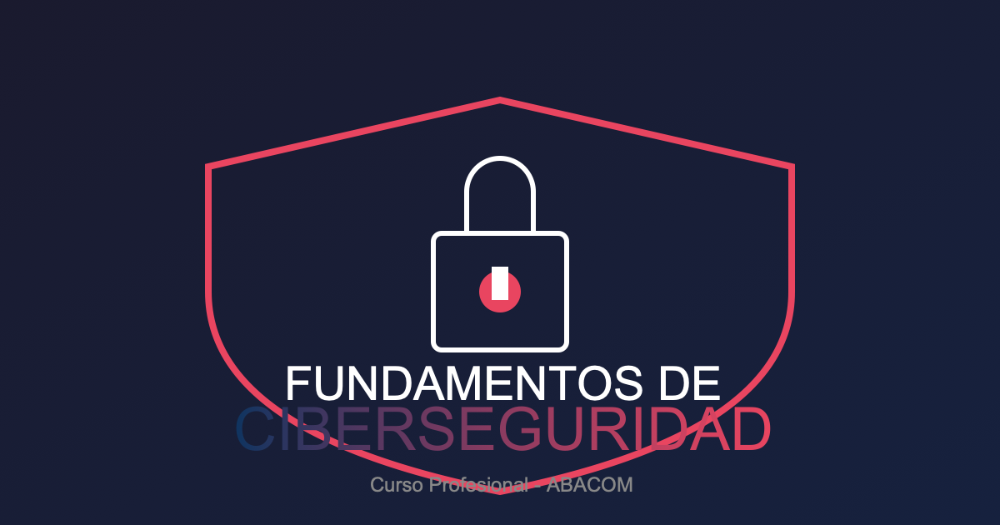

# Fundamentos de Ciberseguridad

::: {.quarto-cover-image style="text-align: center;"}

{width=280px style="display: block; margin: 0 auto;"}

:::

## Objetivo del Curso

Transformar principiantes en **profesionales competentes de ciberseguridad**, capaces de:

- Comprender el marco NIST CSF 2.0 y sus funciones clave
- Implementar arquitecturas Zero Trust
- Gestionar identidad y acceso de forma segura
- Responder a incidentes de seguridad

**Metodologia**: **Aprendizaje basado en RETOS** con 40+ desafios praticos.

---

## Lo que Aprendras

| Modulo | Tema | Horas | Desafios | Laboratorio |
|--------|------|--------|----------|-------------|
| 1 | Fundamentos NIST CSF 2.0 | 6 | 6 | SI |
| 2 | Gestion de Identidad y Acceso | 6 | 6 | SI |
| 3 | Arquitectura Zero Trust | 8 | 8 | SI |
| 4 | Inteligencia Artificial en Seguridad | 6 | 6 | SI |
| 5 | Gestion de Vulnerabilidades | 5 | 5 | SI |
| 6 | Criptografia Post-Cuantica | 5 | 5 | SI |
| 7 | Respuesta a Incidentes | 4 | 4 | SI |

**Total: 40 horas - 7 modulos - 40+ desafios - 7 labs - 7 quizzes**

---

## Metodologia: Aprendizaje Basado en RETOS

A diferencia de cursos teoricos, este curso se centra en la **practica activa**:

### Caracteristicas Distintivas

- **Retos Progresivos**: 40+ ejercicios que aumentan gradualmente en dificultad
- **Laboratorios (Labs)**: 7 sesiones guiadas donde **DEBES teclear los comandos manualmente** (NO copies/pegues!)
- **Quizzes de Evaluacion**: 7 evaluaciones objetivas (70% o superior para aprobar)
- **Proyecto Integrador**: Implementacion de Zero Trust al final

### Flujo de Aprendizaje

<div class="mermaid-diagram" style="background: #1e293b; border-radius: 12px; padding: 20px; margin: 20px 0; border: 1px solid #334155;">
<div style="color: #94a3b8; font-size: 0.85em; margin-bottom: 10px; font-family: monospace;">Flujo de Aprendizaje Basado en Retos</div>
<svg viewBox="0 0 500 100" xmlns="http://www.w3.org/2000/svg" style="width:100%;max-width:500px;">
<rect x="10" y="30" width="90" height="40" rx="8" fill="#3b82f6"/><text x="55" y="55" text-anchor="middle" fill="white" font-size="12" font-weight="bold">Lee el</text><text x="55" y="70" text-anchor="middle" fill="white" font-size="12" font-weight="bold">material</text>
<polygon points="100,50 130,50 125,45 130,55" fill="#94a3b8"/>
<rect x="130" y="30" width="90" height="40" rx="8" fill="#10b981"/><text x="175" y="55" text-anchor="middle" fill="white" font-size="12" font-weight="bold">Ejecuta</text><text x="175" y="70" text-anchor="middle" fill="white" font-size="12" font-weight="bold">el lab</text>
<polygon points="220,50 250,50 245,45 250,55" fill="#94a3b8"/>
<rect x="250" y="30" width="90" height="40" rx="8" fill="#f59e0b"/><text x="295" y="55" text-anchor="middle" fill="white" font-size="12" font-weight="bold">Responde</text><text x="295" y="70" text-anchor="middle" fill="white" font-size="12" font-weight="bold">el quiz</text>
<polygon points="340,50 370,50 365,45 370,55" fill="#94a3b8"/>
<rect x="370" y="30" width="90" height="40" rx="8" fill="#8b5cf6"/><text x="415" y="55" text-anchor="middle" fill="white" font-size="12" font-weight="bold">Com-</text><text x="415" y="70" text-anchor="middle" fill="white" font-size="12" font-weight="bold">prende</text>
<path d="M 415,30 C 415,5 250,5 100,5 C 50,5 20,15 15,25" fill="none" stroke="#64748b" stroke-width="2" stroke-dasharray="4,2"/>
<polygon points="15,30 20,20 10,22" fill="#64748b"/>
<text x="250" y="15" text-anchor="middle" fill="#94a3b8" font-size="10">ciclo continuo</text>
</svg>
</div>

### Flujo de Aprendizaje

El aprendizaje basado en retos sigue un **ciclo iterativo**: leer → practicar → evaluar → comprender → repetir. Cada iteración consolida el conocimiento a un nivel más profundo.

---

## Enfoque 2026: Tendencias Actuales

Este curso esta actualizado con las **principales tendencias de ciberseguridad 2026**:

| Tendencia | Impacto | Modulos |
|-----------|--------|---------|
| IA como vector de ataque | +89% Anual | 4 |
| Identidad como perimetro | 81% de brechas | 2, 3 |
| Zero Trust obligatorio | 96% organizaciones | 3 |
| Criptografia post-cuantica | Estandares NIST 2035 | 6 |

**Fuentes**: CrowdStrike 2026, NIST CSF 2.0, Gartner 2026, WEF Cybersecurity Outlook 2026

---

## Herramientas que Aprendras

### Redes y Escaneo

```bash
#Ejemplos de herramientas
nmap         # Escaneo de puertos
wireshark   # Analisis de trafico
nessus      # Evaluacion de vulnerabilidades
```

### Gestion de Identidad

```bash
#Conceptos clave
OAuth 2.0   # Autorizacion
OpenID      # Autenticacion
FIDO2       # Autenticacion fuerte
LDAP        # Directorio activo
```

### Seguridad Web

```bash
#Herramientas
burp-suite  # Proxy de pruebas
owasp-zap   # Pruebas automaticas
nikto       # Escaneo web
```

---

## Requisitos del Sistema

### Hardware Minimo

| Componente | Requisito |
|-----------|----------|
| RAM | 8 GB |
| CPU | 4 nucleos |
| Almacenamiento | 100 GB SSD |
| Red | 50 Mbps |

### Software

| Tipo | Requisito |
|------|----------|
| SO | Linux (Ubuntu 22.04+) o Windows 11 |
| RAM VM | 4 GB asignados |
| Virtualizacion | VirtualBox o VMware |

---

## Distribucion Semanal (8 semanas)

| Semana | Modulo | Tema | Entregables |
|--------|--------|------|------------|
| 1 | 1 | Fundamentos NIST CSF 2.0 | Quiz 1 |
| 2 | 2 | Gestion de Identidad | Lab 1, Quiz 2 |
| 3-4 | 3 | Arquitectura Zero Trust | Lab 2-3, Quiz 3 |
| 5 | 4 | IA en Seguridad | Lab 4, Quiz 4 |
| 6 | 5 | Gestion Vulnerabilidades | Lab 5, Quiz 5 |
| 7 | 6 | Criptografia Post-Cuantica | Lab 6, Quiz 6 |
| 8 | 7 | Respuesta a Incidentes | Lab 7, Quiz 7 |

**Proyecto Integrador**: Durante todo el curso (entrega semana 8)

---

## Materiales del Curso

### Contenido Principal

- `content/modulo-XX/` - Teoria por modulo
- `labs/` - Laboratorios praticos
- `quizzes/` - Evaluaciones
- `proyectos/` - Proyecto integrador

### Material Instructor

- `instructor/guia-*.md` - Guias por modulo
- `instructor/soluciones-*.md` - Soluciones labs
- `instructor/rubricas.md` - Rubricas de evaluacion

---

## Como Participar

### En el Aula

1. **Lee** el contenido del modulo
2. **Ejecuta** el laboratorio manualmente
3. **Responde** el quiz de evaluacion
4. **Discute** en foros las dudas

### Comandos del workflow

```bash
# Iniciar repositorio local
git init

# Ver estado de cambios
git status

# Crear rama para exercises
git checkout -b exercises/modulo-01

# Commitear progreso
git add . && git commit -m "Completado modulo 1"
```

---

## Licencia

Este curso esta bajo licencia **Creative Commons Compartir Igual 4.0 (CC BY-SA 4.0)**

[](http://creativecommons.org/licenses/by-sa/4.0/)

**Puedes**:

- Compartir: Copiar y redistribuir el material
- Adaptar: Remezclar, transformar y crear

**Bajo condiciones**:

- Atribuir: Dar credito apropiado
- CompartirIgual: Distribuir bajo la misma licencia

---

## Contacto

**Instructor**: Diego Saavedra  
**Especialidad**: Ethical Hacking y Seguridad Ofensiva  
**Formacion**: MSc Ciberseguridad (UCM)

- Perfil: https://statick88.github.io
- Email: dsaavedra88@gmail.com
- LinkedIn: https://linkedin.com/in/diego-saavedra-developer
- GitHub: https://github.com/statick88

---

*"La seguridad no es un producto, es un proceso." — Bruce Schneier*

:::{.centered-footer}
Curso actualizado Mayo 2026 — 40 horas — 7 modulos — CC BY-SA 4.0
:::